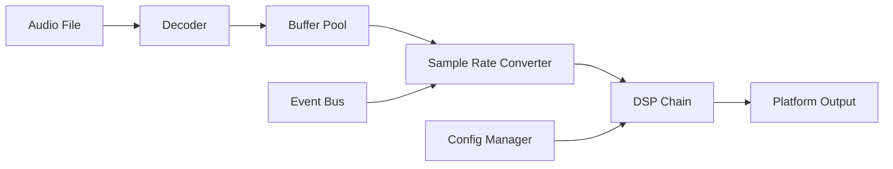

# coreMusicPlayer Architecture Documentation

## 1. System Architecture Overview

coreMusicPlayer follows a layered architecture pattern with clear separation of concerns. The system is designed to be modular, extensible, and maintainable. The current design consolidates 5 different player variants into a unified architecture.

### 1.1 Unified Player Architecture

The project has evolved from separate player executables to a single unified player that can operate in different modes:

- **music_player_legacy** → Legacy Mode
- **music_player_complete** → Complete Mode
- **real_player** → Real-time Mode
- **final_wav_player** → Production Mode
- **multi_format_player** → Multi-format Mode (default)

```
┌─────────────────────────────────────────────────────────────┐
│                    User Interface Layer                        │
├─────────────────────┬───────────────────────────────────────────┤
│    Qt6 GUI          │       Command Line Interface              │
│  (PlayerWidget)     │        (CLIPlayer)                       │
└─────────────────────┴───────────────────────────────────────────┘
                              │
┌─────────────────────────────────────────────────────────────┐
│              Unified Player Management Layer                │
├─────────────────────────────────────────────────────────────┤
│  UnifiedMusicPlayer  │  PlayerModeManager │ ConfigManager   │
│  (Strategy Pattern)  │  (Mode Selection)  │ (Feature Gating)│
└─────────────────────────────────────────────────────────────┘
                              │
┌─────────────────────────────────────────────────────────────┐
│                  Application Logic Layer                    │
├─────────────────────┬───────────────────────────────────────┤
│  PlaylistManager    │      PlaybackController               │
│  DecoderManager     │      AudioManager                     │
│  (Lazy Loading)     │                                       │
└─────────────────────┴───────────────────────────────────────┘
                              │
┌─────────────────────────────────────────────────────────────┐
│                    Core Audio Engine                        │
├─────────────────────┬───────────────────────────────────────┤
│  AudioDecoder       │      SampleRateConverter              │
│  AudioOutput        │      AudioProcessor                   │
│  PluginManager      │      EventBus                         │
│  BufferPool         │      ThreadPool                       │
└─────────────────────┴───────────────────────────────────────┘
                              │
┌─────────────────────────────────────────────────────────────┐
│                  Platform Abstraction Layer                 │
├─────────────────────┬───────────────────────────────────────┤
│   Windows           │          Linux/Unix                   │
│  (WASAPI)           │         (ALSA)                        │
└─────────────────────┴───────────────────────────────────────┘
```

### 1.2 Key Architecture Improvements

1. **Strategy Pattern for Player Modes**: Different player implementations are now strategies that can be switched at runtime
2. **Lazy Loading for Decoders**: Audio decoders are loaded only when needed
3. **Feature Gating System**: Fine-grained control over enabled features
4. **Resource Pool Management**: Efficient memory management with buffer pools
5. **Thread Safety**: Improved thread management with dedicated audio and I/O threads

## 2. Core Components

### 2.1 Unified Player Architecture

#### 2.1.1 UnifiedMusicPlayer with Strategy Pattern
```cpp
// Player strategy interface
class PlayerStrategy {
public:
    virtual ~PlayerStrategy() = default;
    virtual bool initialize(AudioEngine* engine) = 0;
    virtual void optimizePlayback() = 0;
    virtual bool loadFile(const std::string& filename) = 0;
    virtual PlaybackState getPlaybackState() const = 0;
};

// Strategy implementations
class LegacyStrategy : public PlayerStrategy {
    // Basic WAV playback only
    bool initialize(AudioEngine* engine) override {
        // Initialize minimal components
        engine->enableFeature(Feature::BasicPlayback);
        engine->disableFeature(Feature::Plugins);
        engine->disableFeature(Feature::AdvancedDSP);
        return true;
    }

    void optimizePlayback() override {
        // No optimization needed for legacy mode
    }
};

class RealtimeStrategy : public PlayerStrategy {
    // Low-latency optimized playback
    bool initialize(AudioEngine* engine) override {
        engine->enableFeature(Feature::BasicPlayback);
        engine->enableFeature(Feature::RealtimeOptimization);
        engine->setBufferSize(64); // Small buffer for low latency
        engine->enableRealTimePriority();
        return true;
    }

    void optimizePlayback() override {
        // Enable real-time optimizations
        configureRealTimeAudio();
        minimizeBuffering();
    }
};

class ProductionStrategy : public PlayerStrategy {
    // Optimized for production use
    bool initialize(AudioEngine* engine) override {
        engine->enableFeature(Feature::BasicPlayback);
        engine->enableFeature(Feature::SIMDOptimization);
        engine->enableFeature(Feature::AdvancedBuffering);
        engine->enableFeature(Feature::ErrorRecovery);
        return true;
    }
};

// Unified player using strategy pattern
class UnifiedMusicPlayer {
private:
    std::unique_ptr<PlayerStrategy> strategy_;
    std::unique_ptr<AudioEngine> audio_engine_;
    std::unique_ptr<DecoderManager> decoder_manager_;
    PlayerMode current_mode_;

public:
    enum class PlayerMode {
        Legacy,
        Complete,
        Realtime,
        Production,
        MultiFormat
    };

    UnifiedMusicPlayer(PlayerMode mode = PlayerMode::MultiFormat)
        : current_mode_(mode) {
        setMode(mode);
    }

    bool setMode(PlayerMode mode) {
        current_mode_ = mode;

        switch(mode) {
            case PlayerMode::Legacy:
                strategy_ = std::make_unique<LegacyStrategy>();
                break;
            case PlayerMode::Realtime:
                strategy_ = std::make_unique<RealtimeStrategy>();
                break;
            case PlayerMode::Production:
                strategy_ = std::make_unique<ProductionStrategy>();
                break;
            case PlayerMode::Complete:
                strategy_ = std::make_unique<CompleteStrategy>();
                break;
            case PlayerMode::MultiFormat:
            default:
                strategy_ = std::make_unique<MultiFormatStrategy>();
                break;
        }

        return strategy_->initialize(audio_engine_.get());
    }

    bool loadFile(const std::string& filename) {
        return strategy_->loadFile(filename);
    }

    void play() {
        strategy_->optimizePlayback();
        audio_engine_->startPlayback();
    }
};
```

### 2.2 Decoder Manager with Lazy Loading

#### 2.2.1 DecoderManager Implementation
```cpp
class DecoderManager {
private:
    std::unordered_map<std::string, std::unique_ptr<AudioDecoder>> decoders_;
    std::map<std::string, std::function<std::unique_ptr<AudioDecoder>()>> decoder_factories_;
    mutable std::shared_mutex decoder_mutex_;

public:
    DecoderManager() {
        // Register decoder factories
        decoder_factories_["wav"] = []() {
            return std::make_unique<WAVDecoder>();
        };
        decoder_factories_["mp3"] = []() {
            return std::make_unique<MP3Decoder>();
        };
        decoder_factories_["flac"] = []() {
            return std::make_unique<FLACDecoder>();
        };
        decoder_factories_["ogg"] = []() {
            return std::make_unique<OGGDecoder>();
        };
    }

    AudioDecoder* getDecoder(const std::string& format) {
        std::shared_lock lock(decoder_mutex_);

        auto it = decoders_.find(format);
        if (it != decoders_.end()) {
            return it->second.get();
        }

        lock.unlock();

        // Need to load the decoder
        std::unique_lock write_lock(decoder_mutex_);

        // Double-check after acquiring write lock
        it = decoders_.find(format);
        if (it != decoders_.end()) {
            return it->second.get();
        }

        auto factory_it = decoder_factories_.find(format);
        if (factory_it == decoder_factories_.end()) {
            return nullptr;
        }

        auto decoder = factory_it->second();
        if (!decoder->initialize()) {
            return nullptr;
        }

        AudioDecoder* decoder_ptr = decoder.get();
        decoders_[format] = std::move(decoder);

        return decoder_ptr;
    }

    void preloadDecoder(const std::string& format) {
        // Force decoder loading
        getDecoder(format);
    }

    void unloadDecoder(const std::string& format) {
        std::unique_lock lock(decoder_mutex_);
        decoders_.erase(format);
    }

    std::vector<std::string> getSupportedFormats() const {
        std::shared_lock lock(decoder_mutex_);
        std::vector<std::string> formats;
        for (const auto& pair : decoder_factories_) {
            formats.push_back(pair.first);
        }
        return formats;
    }
};
```

### 2.3 Feature Management System

#### 2.3.1 Feature Gating Implementation
```cpp
class FeatureManager {
public:
    enum Features : uint32_t {
        BasicPlayback     = 1 << 0,
        PluginSupport     = 1 << 1,
        RealtimeMode      = 1 << 2,
        AdvancedDSP       = 1 << 3,
        MultiFormat       = 1 << 4,
        SIMDOptimization  = 1 << 5,
        AudioVisualization = 1 << 6,
        AdvancedBuffering = 1 << 7,
        ErrorRecovery     = 1 << 8,
        HotPluginReload   = 1 << 9
    };

private:
    uint32_t enabled_features_;
    std::map<Features, std::string> feature_names_;

public:
    FeatureManager() : enabled_features_(BasicPlayback) {
        // Initialize feature names
        feature_names_[BasicPlayback] = "BasicPlayback";
        feature_names_[PluginSupport] = "PluginSupport";
        feature_names_[RealtimeMode] = "RealtimeMode";
        feature_names_[AdvancedDSP] = "AdvancedDSP";
        feature_names_[MultiFormat] = "MultiFormat";
        feature_names_[SIMDOptimization] = "SIMDOptimization";
        feature_names_[AudioVisualization] = "AudioVisualization";
        feature_names_[AdvancedBuffering] = "AdvancedBuffering";
        feature_names_[ErrorRecovery] = "ErrorRecovery";
        feature_names_[HotPluginReload] = "HotPluginReload";
    }

    void enableFeature(Features feature) {
        enabled_features_ |= feature;
    }

    void disableFeature(Features feature) {
        enabled_features_ &= ~feature;
    }

    bool isFeatureEnabled(Features feature) const {
        return enabled_features_ & feature;
    }

    void setFeatureSet(uint32_t features) {
        enabled_features_ = features;
    }

    uint32_t getFeatureSet() const {
        return enabled_features_;
    }

    // Convenience methods for feature groups
    void enableMinimalSet() {
        enabled_features_ = BasicPlayback;
    }

    void enableStandardSet() {
        enabled_features_ = BasicPlayback | MultiFormat | AdvancedBuffering;
    }

    void enableFullSet() {
        enabled_features_ = BasicPlayback | PluginSupport | AdvancedDSP |
                           MultiFormat | SIMDOptimization | AudioVisualization |
                           AdvancedBuffering | ErrorRecovery | HotPluginReload;
    }

    void enableRealtimeSet() {
        enabled_features_ = BasicPlayback | RealtimeMode | AdvancedBuffering |
                           SIMDOptimization | ErrorRecovery;
    }
};
```

### 2.4 Audio Engine Core

#### 2.4.1 AudioDecoder (Updated with pooling)
```cpp
class AudioDecoder {
public:
    virtual ~AudioDecoder() = default;

    // Core decoding interface
    virtual bool open(const std::string& filename) = 0;
    virtual bool decode(AudioBuffer& buffer, size_t frames) = 0;
    virtual bool seek(size_t frame) = 0;
    virtual void close() = 0;

    // Information queries
    virtual AudioFormat getFormat() const = 0;
    virtual size_t getFrames() const = 0;
    virtual std::map<std::string, std::string> getMetadata() const = 0;

    // Format support
    virtual bool supportsFormat(const std::string& extension) const = 0;
    virtual std::vector<std::string> getSupportedExtensions() const = 0;

    // Error handling
    virtual std::string getLastError() const = 0;
    virtual bool hasError() const = 0;

protected:
    AudioFormat format_;
    std::string last_error_;
};
```

**Key Implementations**:

```cpp
// WAV Decoder Implementation
class WAVDecoder : public AudioDecoder {
public:
    WAVDecoder() : file_(nullptr), data_offset_(0) {}

    bool open(const std::string& filename) override {
        file_ = fopen(filename.c_str(), "rb");
        if (!file_) {
            last_error_ = "Cannot open file";
            return false;
        }

        // Read and validate WAV header
        if (!parseHeader()) {
            fclose(file_);
            file_ = nullptr;
            return false;
        }

        return true;
    }

private:
    FILE* file_;
    size_t data_offset_;
    WAVHeader header_;

    bool parseHeader() {
        // Read RIFF header
        if (fread(&header_, sizeof(WAVHeader), 1, file_) != 1) {
            return false;
        }

        // Validate format
        if (strncmp(header_.riff, "RIFF", 4) != 0 ||
            strncmp(header_.wave, "WAVE", 4) != 0) {
            last_error_ = "Invalid WAV format";
            return false;
        }

        // Extract format information
        format_.sampleRate = header_.sampleRate;
        format_.channels = header_.channels;
        format_.bitsPerSample = header_.bitsPerSample;
        format_.format = AudioFormat::PCM;

        // Find data chunk
        data_offset_ = findDataChunk();
        return data_offset_ > 0;
    }
};

// MP3 Decoder using minimp3
class MP3Decoder : public AudioDecoder {
public:
    MP3Decoder() : mp3_data_(nullptr), file_size_(0) {}

    bool open(const std::string& filename) override {
        // Read entire file for minimp3
        FILE* file = fopen(filename.c_str(), "rb");
        if (!file) return false;

        fseek(file, 0, SEEK_END);
        file_size_ = ftell(file);
        fseek(file, 0, SEEK_SET);

        mp3_data_.reset(new uint8_t[file_size_]);
        fread(mp3_data_.get(), 1, file_size_, file);
        fclose(file);

        // Initialize minimp3 decoder
        mp3dec_init(&mp3d_);

        return true;
    }

private:
    std::unique_ptr<uint8_t[]> mp3_data_;
    size_t file_size_;
    mp3dec_t mp3d_;
};
```

### 2.5 Resource Management

#### 2.5.1 Audio Buffer Pool Implementation
```cpp
class AudioBufferPool {
private:
    struct BufferInfo {
        std::unique_ptr<float[]> data;
        size_t channels;
        size_t frames;
        bool in_use;
    };

    std::vector<BufferInfo> buffers_;
    mutable std::mutex pool_mutex_;
    size_t alignment_ = 32; // AVX2 alignment

    float* allocateAlignedMemory(size_t size) {
#ifdef _WIN32
        return static_cast<float*>(_aligned_malloc(size, alignment_));
#else
        void* ptr = nullptr;
        if (posix_memalign(&ptr, alignment_, size) != 0) {
            return nullptr;
        }
        return static_cast<float*>(ptr);
#endif
    }

    void deallocateAlignedMemory(float* ptr) {
#ifdef _WIN32
        _aligned_free(ptr);
#else
        free(ptr);
#endif
    }

public:
    AudioBufferPool() = default;
    ~AudioBufferPool() {
        std::lock_guard lock(pool_mutex_);
        for (auto& buffer : buffers_) {
            deallocateAlignedMemory(buffer.data.get());
        }
    }

    std::unique_ptr<AudioBuffer> acquire(size_t channels, size_t frames) {
        std::lock_guard lock(pool_mutex_);

        // Try to find a free buffer with matching requirements
        for (auto& buffer : buffers_) {
            if (!buffer.in_use && buffer.channels >= channels &&
                buffer.frames >= frames) {
                buffer.in_use = true;
                return std::make_unique<PooledAudioBuffer>(
                    buffer.data.get(), buffer.channels, buffer.frames, this);
            }
        }

        // No suitable buffer found, create a new one
        const size_t total_samples = channels * frames;
        float* data = allocateAlignedMemory(total_samples * sizeof(float));

        buffers_.push_back({
            std::unique_ptr<float[]>(data),
            channels,
            frames,
            true
        });

        return std::make_unique<PooledAudioBuffer>(
            data, channels, frames, this);
    }

    void release(AudioBuffer* buffer) {
        if (!buffer) return;

        std::lock_guard lock(pool_mutex_);

        // Find and mark the buffer as available
        for (auto& buf : buffers_) {
            if (buf.data.get() == buffer->data()) {
                buf.in_use = false;
                break;
            }
        }
    }

    void prune() {
        std::lock_guard lock(pool_mutex_);
        buffers_.erase(
            std::remove_if(buffers_.begin(), buffers_.end(),
                [](const BufferInfo& buffer) {
                    return !buffer.in_use;
                }),
            buffers_.end());
    }
};

// Pooled audio buffer that automatically returns to pool
class PooledAudioBuffer : public AudioBuffer {
private:
    AudioBufferPool* pool_;

public:
    PooledAudioBuffer(float* data, size_t channels, size_t frames,
                     AudioBufferPool* pool)
        : AudioBuffer(data, channels, frames, false), pool_(pool) {}

    ~PooledAudioBuffer() {
        if (pool_) {
            pool_->release(this);
        }
    }
};
```

#### 2.5.2 Enhanced AudioBuffer with SIMD optimizations
```cpp
class AudioBuffer {
private:
    float* data_;
    int channels_;
    size_t frames_;
    size_t capacity_;
    bool owns_data_;

public:
    AudioBuffer(int channels, size_t frames)
        : channels_(channels), frames_(frames)
        , capacity_(frames), owns_data_(true) {
        allocateMemory();
    }

    AudioBuffer(float* external_data, int channels, size_t frames, bool copy = false)
        : channels_(channels), frames_(frames)
        , capacity_(frames), owns_data_(copy) {
        if (copy) {
            allocateMemory();
            memcpy(data_, external_data, channels * frames * sizeof(float));
        } else {
            data_ = external_data;
        }
    }

    ~AudioBuffer() {
        if (owns_data_ && data_) {
            deallocateMemory();
        }
    }

    // Memory management with alignment for SIMD
    void allocateMemory() {
        const size_t alignment = 32; // AVX2 requires 32-byte alignment
        const size_t size = channels_ * frames_ * sizeof(float);

#ifdef _WIN32
        data_ = static_cast<float*>(_aligned_malloc(size, alignment));
#else
        if (posix_memalign(reinterpret_cast<void**>(&data_), alignment, size) != 0) {
            data_ = nullptr;
        }
#endif

        if (!data_) {
            throw std::bad_alloc();
        }
    }

    void deallocateMemory() {
#ifdef _WIN32
        _aligned_free(data_);
#else
        free(data_);
#endif
        data_ = nullptr;
    }

    // Channel access (non-interleaved)
    float* getChannel(int channel) {
        return data_ + channel * frames_;
    }

    const float* getChannel(int channel) const {
        return data_ + channel * frames_;
    }

    // Interleaved access
    float* getInterleaved() {
        return data_;
    }

    const float* getInterleaved() const {
        return data_;
    }

    // SIMD operations
    void applyGain(float gain) {
        const size_t total_samples = channels_ * frames_;

#ifdef __AVX2__
        applyGainAVX2(data_, total_samples, gain);
#elif defined(__SSE2__)
        applyGainSSE2(data_, total_samples, gain);
#else
        for (size_t i = 0; i < total_samples; ++i) {
            data_[i] *= gain;
        }
#endif
    }

    void mix(const AudioBuffer& other, float gain = 1.0f) {
        assert(channels_ == other.channels_);
        assert(frames_ == other.frames_);

        const size_t total_samples = channels_ * frames_;

#ifdef __AVX2__
        mixAVX2(data_, other.data_, total_samples, gain);
#elif defined(__SSE2__)
        mixSSE2(data_, other.data_, total_samples, gain);
#else
        for (size_t i = 0; i < total_samples; ++i) {
            data_[i] += other.data_[i] * gain;
        }
#endif
    }

    // Convert between interleaved and planar
    void toPlanar() {
        // Implementation for converting interleaved to planar format
    }

    void toInterleaved() {
        // Implementation for converting planar to interleaved format
    }

private:
    // SIMD implementation functions
    void applyGainAVX2(float* data, size_t samples, float gain);
    void applyGainSSE2(float* data, size_t samples, float gain);
    void mixAVX2(float* dest, const float* src, size_t samples, float gain);
    void mixSSE2(float* dest, const float* src, size_t samples, float gain);
};
```

#### 2.1.2 SampleRateConverter
```cpp
class SampleRateConverter {
public:
    enum Quality {
        Fast,       // Linear interpolation
        Good,       // Cubic interpolation
        Best,       - High-quality sinc interpolation
        High        // Ultra-high quality
    };

    bool resample(const AudioBuffer& input, AudioBuffer& output,
                  double inputRate, double outputRate,
                  Quality quality = Quality::Good);
};
```

**Algorithms Implemented**:
- Linear interpolation (Fast)
- Cubic spline (Good)
- Kaiser-windowed sinc (Best/High)
- SIMD-optimized versions for x86/x64

#### 2.1.3 AudioOutput
```cpp
class AudioOutput {
public:
    virtual bool initialize(const AudioFormat& format) = 0;
    virtual bool write(const AudioBuffer& buffer) = 0;
    virtual void pause() = 0;
    virtual void resume() = 0;
    virtual void stop() = 0;
    virtual int getLatency() = 0;
};
```

**Platform Implementations**:
- Windows: `WASAPIOutput`
- Linux: `ALSAOutput`
- Future: `CoreAudioOutput` (macOS)

### 2.2 Plugin System

#### 2.2.1 Plugin Manager Architecture
```cpp
class PluginManager {
public:
    // Plugin lifecycle
    bool loadPlugin(const std::string& path);
    bool unloadPlugin(const std::string& name);
    void reloadAllPlugins();

    // Plugin discovery
    std::vector<std::string> discoverPlugins(const std::string& directory);
    std::vector<PluginInfo> getLoadedPlugins() const;

    // Plugin operations
    template<typename T>
    std::shared_ptr<T> getPlugin(const std::string& name) const;

    // Configuration
    bool configurePlugin(const std::string& name, const PluginConfig& config);
    PluginConfig getPluginConfig(const std::string& name) const;

    // Events
    void onPluginLoaded(std::function<void(const std::string&)> callback);
    void onPluginUnloaded(std::function<void(const std::string&)> callback);

private:
    struct PluginInfo {
        HMODULE handle;
        std::string name;
        std::string path;
        std::string version;
        std::string author;
        std::shared_ptr<PluginInterface> instance;
        bool enabled;
    };

    std::map<std::string, PluginInfo> plugins_;
    std::vector<std::function<void(const std::string&)>> loaded_callbacks_;
    std::vector<std::function<void(const std::string&)>> unloaded_callbacks_;
};
```

#### 2.2.2 Plugin Interface
```cpp
class PluginInterface {
public:
    virtual ~PluginInterface() = default;

    // Plugin identification
    virtual std::string getName() const = 0;
    virtual std::string getVersion() const = 0;
    virtual std::string getAuthor() const = 0;
    virtual std::string getDescription() const = 0;

    // Lifecycle
    virtual bool initialize() = 0;
    virtual void shutdown() = 0;
    virtual bool isEnabled() const = 0;

    // Audio processing (for DSP plugins)
    virtual void process(float* buffer, size_t frames, int channels) = 0;

    // Configuration
    virtual bool setConfig(const PluginConfig& config) = 0;
    virtual PluginConfig getConfig() const = 0;
};
```

### 2.3 Threading Architecture

#### 2.3.1 Thread Pool Implementation
```cpp
class ThreadPool {
public:
    explicit ThreadPool(size_t num_threads = std::thread::hardware_concurrency());
    ~ThreadPool();

    template<typename F, typename... Args>
    auto submit(F&& f, Args&&... args) -> std::future<typename std::result_of<F(Args...)>::type>;

    void setThreadPriority(ThreadPriority priority);
    void shutdown();

private:
    void workerThread();

    std::vector<std::thread> workers_;
    std::queue<std::function<void()>> tasks_;
    std::mutex queue_mutex_;
    std::condition_variable condition_;
    std::atomic<bool> stop_;
    ThreadPriority priority_;
};
```

#### 2.3.2 Audio Thread Management
```cpp
class AudioThreadManager {
public:
    AudioThreadManager();
    ~AudioThreadManager();

    // Start/stop audio processing thread
    bool start();
    void stop();
    bool isRunning() const;

    // Audio callback registration
    using AudioCallback = std::function<void*(size_t frames)>;
    void setAudioCallback(AudioCallback callback);

    // Thread priority
    void setRealTimePriority(bool enabled);

private:
    void audioThreadProc();

    std::thread audio_thread_;
    std::atomic<bool> running_;
    AudioCallback audio_callback_;
    ThreadPriority priority_;
};
```

### 2.4 Event System

#### 2.4.1 Event Bus Implementation
```cpp
template<typename EventType>
class EventBus {
public:
    using EventHandler = std::function<void(const EventType&)>;

    // Subscribe to events
    size_t subscribe(EventHandler handler);
    void unsubscribe(size_t handler_id);

    // Publish events
    void publish(const EventType& event);
    void publishAsync(const EventType& event);

    // Event queue processing
    void processEvents();

private:
    struct HandlerInfo {
        size_t id;
        EventHandler handler;
        bool active;
    };

    std::vector<HandlerInfo> handlers_;
    std::mutex handlers_mutex_;
    std::queue<EventType> event_queue_;
    std::mutex queue_mutex_;
    std::atomic<size_t> next_id_{1};
};
```

#### 2.4.2 Event Types
```cpp
// Audio events
struct TrackChangeEvent {
    std::string old_track;
    std::string new_track;
    double position;
};

struct PlaybackStateEvent {
    enum State { Stopped, Playing, Paused };
    State state;
    double position;
};

// UI events
struct VolumeChangeEvent {
    double old_volume;
    double new_volume;
};

struct SeekEvent {
    double old_position;
    double new_position;
};
```

#### 2.2.1 Plugin Architecture
The plugin system is designed around the Foobar2000 SDK for compatibility:

```cpp
class PluginManager {
private:
    std::vector<std::unique_ptr<Plugin>> loaded_plugins_;
    ServiceRegistry service_registry_;

public:
    bool loadPlugin(const std::string& path);
    void unloadPlugin(const std::string& name);
    Plugin* getPlugin(const std::string& name);
    template<typename T>
    T* getService();
};
```

**Plugin Types**:
1. **Decoder Plugins** - Audio format decoders
2. **DSP Plugins** - Audio processing effects
3. **Output Plugins** - Audio device handlers
4. **Visualization Plugins** - Audio visualizers

#### 2.2.2 Service Registry
```cpp
class ServiceRegistry {
public:
    template<typename Interface>
    void register_service(std::unique_ptr<Interface> service);

    template<typename Interface>
    Interface* get_service();

    template<typename Interface>
    void for_each_service(std::function<void(Interface*)> callback);
};
```

### 2.3 Audio Processing Pipeline

```cpp
class AudioProcessingPipeline {
private:
    std::vector<std::unique_ptr<AudioProcessor>> processors_;

public:
    void addProcessor(std::unique_ptr<AudioProcessor> processor);
    void process(AudioBuffer& buffer);
    void clear();
};
```

**Built-in Processors**:
- VolumeControl
- ChannelMixer
- Resampler
- Equalizer (future)
- Compressor (future)

## 3. GUI Architecture

### 3.1 Qt6 GUI Structure

#### 3.1.1 Main Window (MainWindow)
```cpp
class MainWindow : public QMainWindow {
    Q_OBJECT
private:
    PlayerWidget* player_widget_;
    PlaylistWidget* playlist_widget_;
    MenuManager* menu_manager_;
    StatusBar* status_bar_;

    // Audio components
    std::unique_ptr<PlaybackController> playback_controller_;
    std::unique_ptr<PlaylistManager> playlist_manager_;
};
```

#### 3.1.2 Player Widget (PlayerWidget)
```cpp
class PlayerWidget : public QWidget {
    Q_OBJECT
signals:
    void playPauseRequested();
    void stopRequested();
    void seekRequested(double position);
    void volumeChanged(int volume);

private slots:
    void onPlayPauseClicked();
    void onStopClicked();
    void onPositionChanged(qint64 position);
    void onVolumeChanged(int volume);
};
```

#### 3.1.3 Playlist Widget (PlaylistWidget)
```cpp
class PlaylistWidget : public QWidget {
    Q_OBJECT
private:
    QListView* list_view_;
    PlaylistModel* model_;
    QSortFilterProxyModel* proxy_model_;

    // Drag and drop
    void setupDragAndDrop();
};
```

### 3.2 Model-View-Controller (MVC) Pattern

#### 3.2.1 Models
- `PlaylistModel` - Manages playlist data
- `TrackModel` - Represents individual tracks
- `PluginModel` - Plugin list for settings

#### 3.2.2 Controllers
- `PlaybackController` - Controls audio playback
- `VolumeController` - Manages volume
- `PluginController` - Manages plugin settings

## 4. Event System

### 4.1 EventBus Implementation
```cpp
class EventBus {
public:
    template<typename EventType>
    void publish(const EventType& event);

    template<typename EventType, typename Handler>
    void subscribe(Handler&& handler);

    template<typename EventType>
    void unsubscribe();
};
```

### 4.2 Event Types
```cpp
struct TrackChangedEvent {
    std::string filename;
    AudioFormat format;
};

struct PlaybackStateChangedEvent {
    PlaybackState state; // Playing, Paused, Stopped
};

struct VolumeChangedEvent {
    double volume; // 0.0 to 1.0
};
```

## 5. Configuration Management

### 5.1 Configuration Structure
```cpp
class ConfigManager {
private:
    nlohmann::json config_;
    std::string config_file_;

public:
    template<typename T>
    T get(const std::string& key, const T& default_value = T{});

    template<typename T>
    void set(const std::string& key, const T& value);

    void load();
    void save();
};
```

### 5.2 Configuration Categories
- **Audio Settings**: Sample rate, buffer size, output device
- **GUI Settings**: Theme, window size, column visibility
- **Playlist Settings**: Auto-save, repeat mode, shuffle
- **Plugin Settings**: Enabled plugins, plugin configurations

## 6. Threading Model (Updated)

### 6.1 Thread Architecture
```
Main Thread (GUI & Event Dispatch)
    │
    ├─── Audio Thread (Real-time audio processing)
    │   │   ├─── Lock-free audio queue
    │   │   └─── SIMD-optimized processing
    │   │
    ├─── Decoder Thread Pool (File decoding)
    │   ├─── Thread-local decoders
    │   └─── Lazy loading management
    │   │
    ├─── I/O Thread (File operations)
    │   └─── Asynchronous I/O operations
    │
    └─── Worker Thread Pool (Background tasks)
        ├─── Plugin processing
        ├─── Metadata extraction
        └─── Configuration I/O
```

### 6.2 Thread Safety Strategy (Enhanced)

#### 6.2.1 Synchronization Primitives
```cpp
// Thread-safe audio engine core
class AudioEngine {
private:
    // Audio data protection - No mutex for real-time path
    alignas(64) std::atomic<float> volume_{1.0f};
    alignas(64) std::atomic<PlaybackState> state_{PlaybackState::Stopped};

    // Configuration protection - RW lock for read-heavy operations
    mutable std::shared_mutex config_mutex_;
    AudioFormat current_format_;

    // Decoder cache protection - Mutex with low contention
    mutable std::mutex decoder_mutex_;
    std::unordered_map<std::string, std::unique_ptr<AudioDecoder>> decoders_;

    // Cross-thread communication - Lock-free queues
    moodycamel::ConcurrentQueue<AudioCommand> command_queue_;
    moodycamel::ConcurrentQueue<AudioEvent> event_queue_;

public:
    // Real-time audio callback (no locking!)
    void audioCallback(float* output, size_t frames) {
        // Fast path - no mutexes
        if (state_.load(std::memory_order_acquire) == PlaybackState::Playing) {
            const float vol = volume_.load(std::memory_order_relaxed);
            processAudioWithSIMD(output, frames, vol);
        }
    }

    // Configuration update (write lock)
    void updateFormat(const AudioFormat& format) {
        std::unique_lock lock(config_mutex_);
        current_format_ = format;
        notifyFormatChange(format);
    }

    // Decoder access (double-checked locking)
    AudioDecoder* getDecoder(const std::string& format) {
        {
            std::shared_lock lock(config_mutex_);
            auto it = decoders_.find(format);
            if (it != decoders_.end()) {
                return it->second.get();
            }
        }

        // Need to load decoder
        std::unique_lock lock(config_mutex_);
        // Double-check pattern
        auto it = decoders_.find(format);
        if (it != decoders_.end()) {
            return it->second.get();
        }

        return loadDecoder(format);
    }
};
```

#### 6.2.2 Deadlock Prevention Rules

1. **Lock Ordering**: Always acquire locks in the same order
   ```cpp
   // Correct order
   config_mutex_  ->  decoder_mutex_  ->  plugin_mutex_
   ```

2. **Lock Duration**: Minimize lock holding time
   ```cpp
   // Bad - long critical section
   std::lock_guard<std::mutex> lock(mutex_);
   longOperation();  // Might take seconds

   // Good - copy data, process outside lock
   Data copy;
   {
       std::lock_guard<std::mutex> lock(mutex_);
       copy = data_;
   }
   longOperation();
   ```

3. **Avoid Nested Locks**: Use lock-free alternatives when possible

#### 6.2.3 Thread-Local Storage Optimization
```cpp
// Thread-local decoder to avoid contention
thread_local std::unique_ptr<AudioDecoder> t_local_decoder_;

AudioDecoder* DecoderManager::getThreadLocalDecoder(const std::string& format) {
    if (!t_local_decoder_ || t_local_decoder_->getFormat() != format) {
        t_local_decoder_ = createDecoder(format);
    }
    return t_local_decoder_.get();
}
```

### 6.3 Memory Ordering (Explicit)

```cpp
class PlayerState {
private:
    std::atomic<PlaybackState> state_;
    std::atomic<uint64_t> position_frames_;
    std::atomic<bool> seek_requested_;

public:
    void requestSeek(uint64_t position) {
        position_frames_.store(position, std::memory_order_release);
        seek_requested_.store(true, std::memory_order_release);
    }

    bool checkSeekRequest(uint64_t& out_position) {
        if (seek_requested_.load(std::memory_order_acquire)) {
            out_position = position_frames_.load(std::memory_order_acquire);
            seek_requested_.store(false, std::memory_order_release);
            return true;
        }
        return false;
    }
};
```

### 6.4 Thread Affinity and Priority

```cpp
class ThreadManager {
public:
    void configureAudioThread(std::thread& thread) {
#ifdef _WIN32
        // Set real-time priority
        SetThreadPriority(thread.native_handle(), THREAD_PRIORITY_TIME_CRITICAL);

        // Set CPU affinity (avoid core 0 which might be busy with system)
        SetThreadAffinityMask(thread.native_handle(), 0x2); // Core 1

        // Disable timer resolution coalescing
        timeBeginPeriod(1);
#else
        // Linux equivalent
        sched_param param;
        param.sched_priority = 99;
        pthread_setschedparam(thread.native_handle(), SCHED_FIFO, &param);

        cpu_set_t cpuset;
        CPU_ZERO(&cpuset);
        CPU_SET(1, &cpuset);
        pthread_setaffinity_np(thread.native_handle(), sizeof(cpuset), &cpuset);
#endif
    }
};
```

## 7. Error Handling Framework (New)

### 7.1 Unified Error Handling

coreMusicPlayer uses a Result<T> type for error propagation, eliminating exceptions for better performance and explicit error handling:

```cpp
#include "result.h"
#include "error.h"

// All API functions return Result
Result<void> AudioEngine::initialize(const AudioConfig& config) {
    if (!initializeDevice(config)) {
        return Result<void>::error(
            Error(ErrorCategory::AudioInitialization,
                  "Failed to initialize audio device")
                .addContext("device", config.deviceName)
                .addContext("sample_rate", config.sampleRate)
        );
    }

    auto bufferResult = allocateBuffers(config);
    if (bufferResult.isError()) {
        return Result<void>::error(bufferResult.getError());
    }

    return Result<void>::success();
}
```

### 7.2 Error Recovery Strategies

#### 7.2.1 Automatic Recovery
```cpp
class AudioOutput {
private:
    VoidResult handleBufferUnderrun() {
        // Increase buffer size
        current_buffer_size_ *= 2;
        if (current_buffer_size_ > MAX_BUFFER_SIZE) {
            return VoidResult::error(
                Error(ErrorCategory::AudioBufferOverrun,
                      "Maximum buffer size exceeded")
                    .addContext("current_size", current_buffer_size_));
        }

        return reinitializeBuffers();
    }

public:
    VoidResult writeAudio(const AudioBuffer& buffer) {
        auto result = writeToDevice(buffer);
        if (result.isError()) {
            auto& error = result.getError();

            // Attempt recovery based on error type
            if (error.getCategory() == ErrorCategory::AudioBufferUnderrun) {
                auto recoveryResult = handleBufferUnderrun();
                if (recoveryResult.isSuccess()) {
                    // Retry write after recovery
                    return writeToDevice(buffer);
                }
            }

            return VoidResult::error(error);
        }

        return VoidResult::success();
    }
};
```

#### 7.2.2 Graceful Degradation
```cpp
class SampleRateConverter {
public:
    Result<AudioBuffer> convert(const AudioBuffer& input,
                               int targetRate,
                               Quality desiredQuality) {
        // Try desired quality first
        auto result = convertWithQuality(input, targetRate, desiredQuality);
        if (result.isSuccess()) {
            return result;
        }

        // Fall back progressively
        if (desiredQuality > Quality::Good) {
            logWarning("Falling back to Good quality");
            return convertWithQuality(input, targetRate, Quality::Good);
        }

        if (desiredQuality > Quality::Fast) {
            logWarning("Falling back to Fast quality");
            return convertWithQuality(input, targetRate, Quality::Fast);
        }

        return Result<AudioBuffer>::error(
            Error(ErrorCategory::UnsupportedFormat,
                  "All conversion quality levels failed"));
    }
};
```

### 7.3 Error Context and Debugging

```cpp
// Rich error context for debugging
class AudioDecoder {
public:
    Result<AudioFormat> detectFormat(const std::string& filename) {
        FILE* file = fopen(filename.c_str(), "rb");
        if (!file) {
            return Result<AudioFormat>::error(
                Error(ErrorCategory::FileNotFound,
                      "Cannot open file for reading")
                    .addContext("filename", filename)
                    .addContext("errno", errno)
                    .addContext("working_directory", getCurrentDirectory()));
        }

        // Read header...
        Header header;
        if (fread(&header, sizeof(header), 1, file) != 1) {
            fclose(file);
            return Result<AudioFormat>::error(
                Error(ErrorCategory::FileCorrupted,
                      "Failed to read file header")
                    .addContext("filename", filename)
                    .addContext("file_size", getFileSize(filename))
                    .addContext("header_size", sizeof(header)));
        }

        fclose(file);
        return Result<AudioFormat>::success(parseFormat(header));
    }
};
```

## 8. Memory Management

### 8.1 Audio Buffer Management
```cpp
class AudioBuffer {
private:
    std::unique_ptr<float[]> data_;
    size_t size_;
    size_t capacity_;

public:
    AudioBuffer(size_t channels, size_t frames);
    void resize(size_t frames);
    float* data() { return data_.get(); }
};
```

### 8.2 Resource Pool
```cpp
template<typename T>
class ResourcePool {
private:
    std::queue<std::unique_ptr<T>> available_;
    std::mutex mutex_;

public:
    std::unique_ptr<T> acquire();
    void release(std::unique_ptr<T> resource);
};
```

## 9. Platform Specifics

### 9.1 Windows (WASAPI)
```cpp
class WASAPIOutput : public AudioOutput {
private:
    IAudioClient* audio_client_;
    IAudioRenderClient* render_client_;
    HANDLE audio_event_;

    // Buffer management
    UINT32 buffer_frames_;
    double latency_;

public:
    bool initialize(const AudioFormat& format) override;
    bool write(const AudioBuffer& buffer) override;
};
```

### 9.2 Linux (ALSA)
```cpp
class ALSAOutput : public AudioOutput {
private:
    snd_pcm_t* pcm_handle_;
    snd_pcm_hw_params_t* hw_params_;

public:
    bool initialize(const AudioFormat& format) override;
    bool write(const AudioBuffer& buffer) override;
};
```

## 10. Performance Optimizations

### 10.1 SIMD Optimizations
```cpp
// SIMD-accelerated volume adjustment
void adjust_volume_simd(float* buffer, size_t frames, float volume);

// SIMD-accelerated sample rate conversion
void resample_simd(const float* input, float* output,
                  size_t input_frames, size_t output_frames);
```

### 10.2 Memory Optimization
- Pre-allocated audio buffers
- Memory-mapped file I/O for large files
- Lock-free ring buffers for audio streaming
- Object pooling for frequent allocations

### 10.3 CPU Optimization
- Multi-threaded decoding
- Asynchronous I/O operations
- CPU affinity for audio thread
- Real-time priority handling

## 11. Testing Architecture

### 11.1 Unit Tests
- Audio decoder tests
- Sample rate conversion accuracy tests
- Plugin loading tests
- Configuration tests

### 11.2 Integration Tests
- End-to-end playback tests
- Plugin interaction tests
- Cross-platform compatibility tests

### 11.3 Performance Tests
- Latency measurements
- CPU usage benchmarks
- Memory usage profiling
- Stress testing with large playlists

## 12. Data Flow Architecture

### 12.1 Audio Processing Pipeline


### 12.2 Plugin Processing Chain
```cpp
class AudioProcessingPipeline {
private:
    std::vector<std::unique_ptr<AudioProcessor>> processors_;
    ThreadPool worker_pool_;

public:
    void addProcessor(std::unique_ptr<AudioProcessor> processor) {
        processors_.push_back(std::move(processor));
    }

    void process(AudioBuffer& buffer) {
        // Process in parallel when possible
        if (processors_.size() > 2) {
            processParallel(buffer);
        } else {
            processSequential(buffer);
        }
    }

private:
    void processSequential(AudioBuffer& buffer) {
        for (auto& processor : processors_) {
            if (processor && processor->isEnabled()) {
                processor->process(buffer);
            }
        }
    }

    void processParallel(AudioBuffer& buffer) {
        // Split buffer for parallel processing
        size_t chunk_size = buffer.getFrames() / processors_.size();

        std::vector<std::future<void>> futures;
        for (size_t i = 0; i < processors_.size(); ++i) {
            futures.push_back(worker_pool_.submit([&, i]() {
                auto chunk = buffer.getChunk(i * chunk_size, chunk_size);
                processors_[i]->process(*chunk);
            }));
        }

        // Wait for all processors to complete
        for (auto& future : futures) {
            future.wait();
        }

        // Mix processed chunks
        buffer.mixChunks();
    }
};
```

## 13. Configuration Management Architecture

### 13.1 Hierarchical Configuration System
```cpp
class ConfigurationManager {
private:
    struct ConfigLayer {
        std::string name;
        int priority;  // Higher overrides lower
        nlohmann::json data;
        bool persistent;
    };

    std::vector<ConfigLayer> layers_;
    nlohmann::json merged_config_;
    std::string config_path_;

public:
    // Layer management
    void addLayer(const std::string& name, int priority,
                  const nlohmann::json& config, bool persistent = false);
    void removeLayer(const std::string& name);

    // Value access with fallback chain
    template<typename T>
    T getValue(const std::string& key, const T& defaultValue = T{}) const;

    template<typename T>
    void setValue(const std::string& key, const T& value,
                   const std::string& layer = "user");

    // Persistence
    bool loadFromFile(const std::string& path);
    bool saveToFile(const std::string& path) const;

    // Hot reloading
    void enableHotReload(const std::string& watchPath);
    void disableHotReload();

private:
    void mergeConfigs();
    void notifyChange(const std::string& key);
};
```

### 13.2 Type-Safe Configuration Wrapper
```cpp
template<typename T>
class ConfigProperty {
private:
    ConfigurationManager* config_;
    std::string key_;
    T default_value_;
    T cached_value_;
    std::function<void(const T&)> change_callback_;

public:
    ConfigProperty(ConfigurationManager* config, const std::string& key,
                  const T& defaultValue = T{})
        : config_(config), key_(key), default_value_(defaultValue) {
        cached_value_ = config_->getValue<T>(key, defaultValue);
    }

    T get() const { return cached_value_; }

    void set(const T& value) {
        if (value != cached_value_) {
            config_->setValue<T>(key_, value);
            cached_value_ = value;
            if (change_callback_) {
                change_callback_(value);
            }
        }
    }

    void setCallback(std::function<void(const T&)> callback) {
        change_callback_ = callback;
    }

    operator T() const { return get(); }

    ConfigProperty& operator=(const T& value) {
        set(value);
        return *this;
    }
};
```

## 14. Security Considerations

### 14.1 Plugin Security
- Plugin sandboxing
- API permission system
- Plugin validation before loading
- Crash isolation

### 14.2 File Security
- Path traversal protection
- Format validation
- Metadata sanitization
- Resource limits

## 15. Performance Monitoring

### 15.1 Real-time Metrics
```cpp
class PerformanceMonitor {
private:
    struct Metrics {
        double cpu_usage;
        size_t memory_usage;
        double audio_latency;
        size_t buffer_underruns;
        std::chrono::nanoseconds processing_time;
    };

    Metrics current_metrics_;
    std::thread monitor_thread_;
    std::atomic<bool> monitoring_{false};

public:
    void startMonitoring();
    void stopMonitoring();
    Metrics getCurrentMetrics() const;
    void reportMetrics() const;

private:
    void monitorLoop();
    void measureAudioLatency();
    void measureCPUUsage();
};
```

### 15.2 Benchmarking Framework
```cpp
class BenchmarkSuite {
public:
    struct BenchmarkResult {
        std::string name;
        std::chrono::nanoseconds duration;
        size_t iterations;
        double throughput;
    };

    void addBenchmark(const std::string& name,
                      std::function<void()> benchmark);
    void runBenchmarks();
    void saveResults(const std::string& filename) const;
    std::vector<BenchmarkResult> getResults() const;

private:
    std::vector<std::pair<std::string, std::function<void()>>> benchmarks_;
    std::vector<BenchmarkResult> results_;
};
```

This architecture provides a solid foundation for building a robust, extensible audio player that can grow with future requirements while maintaining clean separation of concerns. The detailed implementation examples and code snippets serve as guides for developers working on the project.