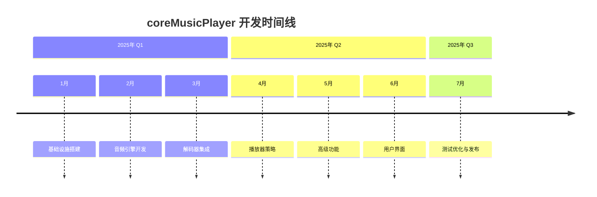
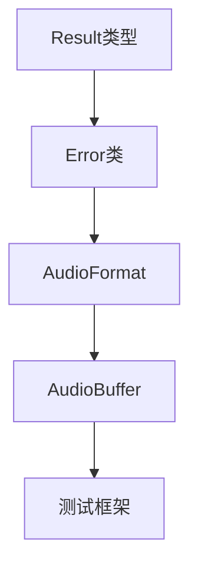
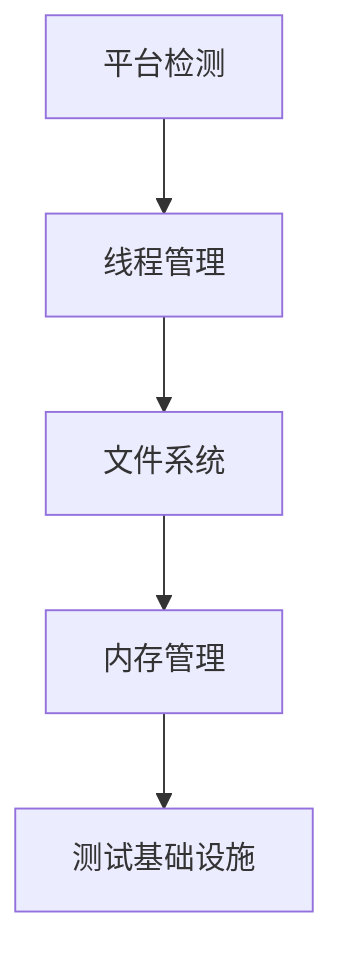
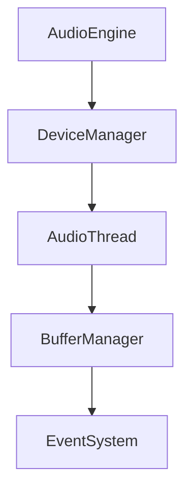
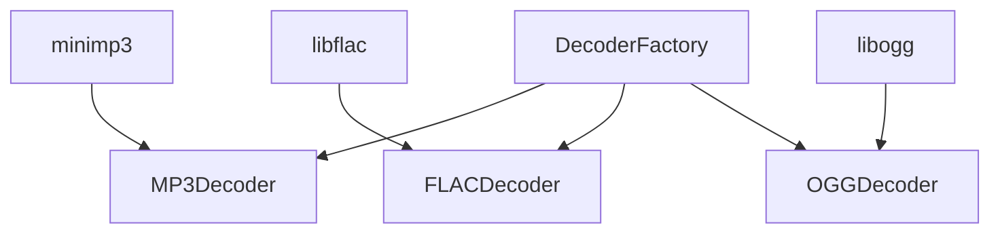
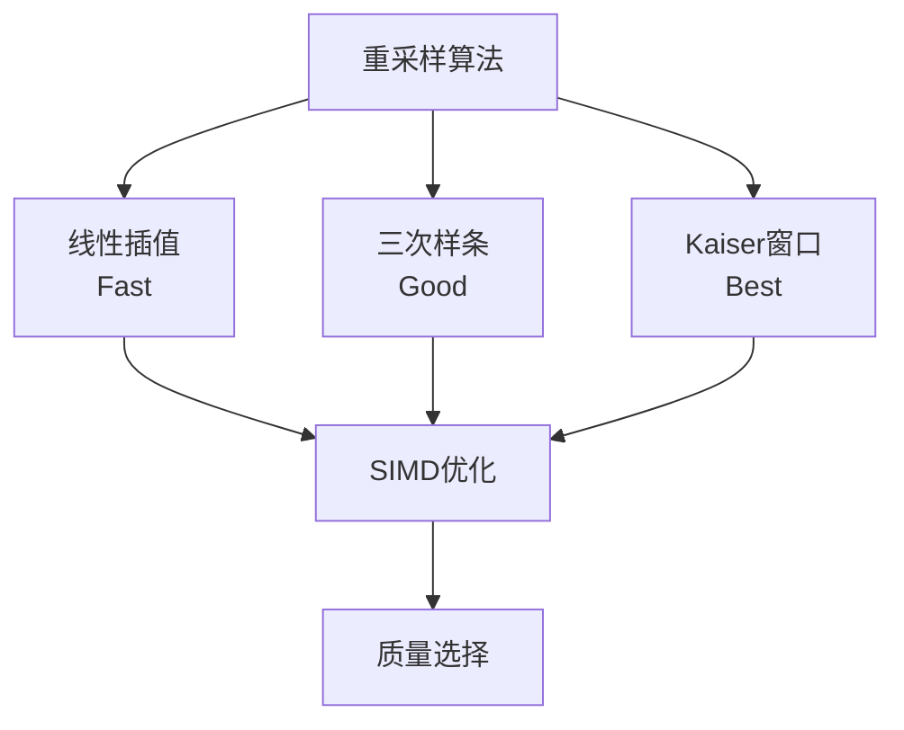
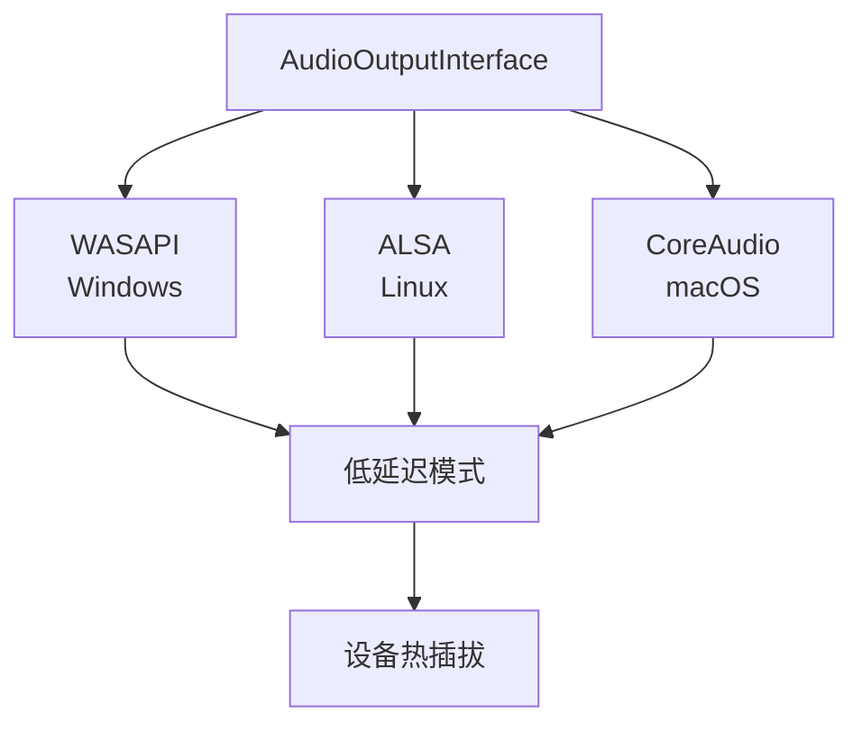
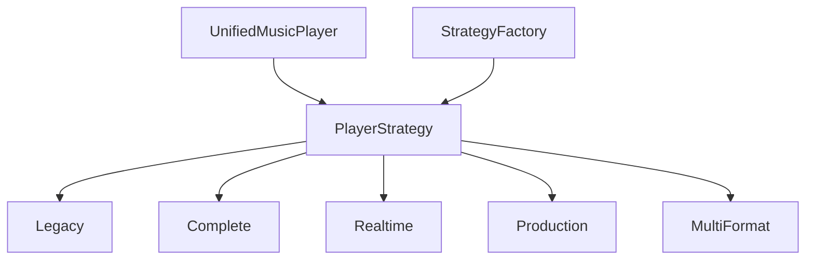
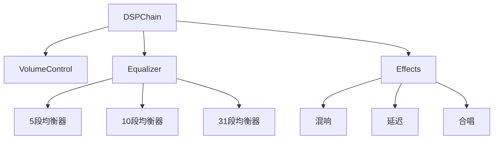
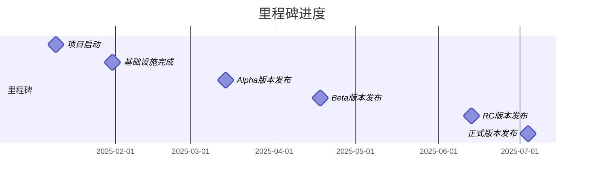

# coreMusicPlayer 开发路线图

## 🎯 总体目标

开发一个高性能、跨平台、模块化的音频播放器，支持5种播放模式，提供从基础WAV播放到专业级音频处理的全套功能。

## 📅 开发阶段总览

## 🚀 详细开发路线图

### 阶段 1: 基础设施 (Week 1-4)
**目标**: 建立坚实的开发基础

#### Week 1: 项目启动 (2025-01-06 至 2025-01-10)

**关键交付物**:
- ✅ GitHub仓库初始化
- ✅ GitHub Actions配置
- ✅ clang-format/clang-tidy配置
- ✅ 目录结构建立
- ✅ CMakeLists.txt基础配置

#### Week 2: 核心类型系统 (2025-01-13 至 2025-01-17)

**技术要点**:
- 零成本抽象设计
- 强类型错误处理
- 内存安全保证
- SIMD友好的数据结构

#### Week 3: 配置与日志 (2025-01-20 至 2025-01-24)

**特性**:
- 热重载配置
- 多级日志
- 结构化日志输出
- 实时性能监控

#### Week 4: 平台抽象 (2025-01-27 至 2025-01-31)

---

### 阶段 2: 音频引擎 (Week 5-10)
**目标**: 实现高质量的音频处理核心

#### Week 5-6: 音频引擎框架 (2025-02-03 至 2025-02-14)

**关键设计**:
- 实时音频线程优先级
- 无锁数据结构
- 双缓冲/三缓冲策略
- 错误恢复机制

#### Week 6-7: 解码器架构 (2025-02-10 至 2025-02-21)

**设计原则**:
- 插件化解码器
- 流式解码支持
- 内存映射文件读取
- 错误恢复策略

#### Week 7-8: 第三方解码器 (2025-02-17 至 2025-02-28)

**集成挑战**:
- 编码检测
- 元数据提取
- 解码错误处理
- 性能优化

#### Week 8-9: 采样率转换 (2025-02-24 至 2025-03-07)

**技术细节**:
- 实时重采样
- 抗混叠滤波
- 多线程优化
- 动态质量调整

#### Week 9-10: 跨平台音频输出 (2025-03-03 至 2025-03-14)

**里程碑**: Alpha版本发布 (Week 10)

---

### 阶段 3: 播放器策略 (Week 11-15)
**目标**: 实现5种播放模式的策略系统

#### Week 11: 策略模式框架 (2025-03-17 至 2025-03-21)

#### Week 11-12: Legacy模式 (2025-03-17 至 2025-03-28)
- 最小依赖
- 仅WAV支持
- 2KB缓冲区
- 基础控制

#### Week 12-13: Complete模式 (2025-03-24 至 2025-04-04)
- 全功能启用
- 4KB缓冲区
- 高级DSP
- 完整插件

#### Week 13-14: Realtime模式 (2025-03-31 至 2025-04-11)
- 64样本缓冲
- 实时优先级
- 无锁设计
- 延迟监控

#### Week 14-15: Production模式 (2025-04-07 至 2025-04-18)
- 错误恢复
- 详细日志
- 可选插件
- 健康检查

#### Week 15: MultiFormat模式 (2025-04-14 至 2025-04-18)
- 智能检测
- 平衡性能
- 全解码器
- 默认配置

**里程碑**: Beta版本发布 (Week 15)

---

### 阶段 4: 高级功能 (Week 16-19)
**目标**: 实现专业音频功能

#### Week 16-17: DSP效果器 (2025-04-21 至 2025-05-02)

#### Week 17-18: 插件系统 (2025-04-28 至 2025-05-09)
- Foobar2000 SDK
- 插件生命周期
- 安全沙箱
- API封装

#### Week 18: 热重载 (2025-05-05 至 2025-05-09)
- 文件监控
- 动态加载
- 状态保存
- 依赖管理

#### Week 19: 资源优化 (2025-05-12 至 2025-05-16)
- 内存池
- CPU优化
- 缓存策略
- 性能监控

---

### 阶段 5: 用户界面 (Week 20-23)
**目标**: 创建现代化用户界面

#### Week 20: Qt6框架 (2025-05-19 至 2025-05-23)
- 应用框架
- 主窗口
- 主题系统
- 国际化

#### Week 20-21: 播放控件 (2025-05-19 至 2025-05-30)
- 播放控制
- 进度条
- 音量控制
- 模式切换

#### Week 21-22: 播放列表 (2025-05-26 至 2025-06-06)
- 列表模型
- 拖拽排序
- 搜索过滤
- 持久化

#### Week 22: 设置界面 (2025-06-02 至 2025-06-06)
- 设备选择
- 模式配置
- 快捷键
- 主题定制

#### Week 23: 可视化 (2025-06-09 至 2025-06-13)
- 频谱分析
- 波形显示
- 动画效果
- 自定义主题

**里程碑**: RC版本发布 (Week 23)

---

### 阶段 6: 测试与发布 (Week 24-26)
**目标**: 全面测试、优化、发布准备

#### Week 24: 集成测试 (2025-06-16 至 2025-06-20)
- 端到端测试
- 多平台测试
- 性能测试
- 用户测试

#### Week 24-25: 性能优化 (2025-06-16 至 2025-06-27)
- 延迟优化
- CPU优化
- 内存优化
- 启动优化

#### Week 25-26: 文档部署 (2025-06-23 至 2025-07-04)
- API文档
- 用户手册
- 安装包
- 发布说明

**里程碑**: 正式版本发布 (Week 26)

## 📊 里程碑追踪

### 里程碑清单

| 里程碑 | 日期 | 关键交付物 | 成功标准 |
|--------|------|-----------|----------|
| M1: 项目启动 | Week 1 | 项目基础设施 | CI/CD运行正常 |
| M2: 基础设施完成 | Week 4 | 核心框架 | 所有单元测试通过 |
| M3: Alpha版本 | Week 10 | 基础播放功能 | WAV文件正常播放 |
| M4: Beta版本 | Week 15 | 多格式支持 | 支持MP3/FLAC/OGG |
| M5: RC版本 | Week 23 | 完整功能 | 所有功能实现 |
| M6: 正式发布 | Week 26 | 生产就绪 | 达到所有性能目标 |

### 里程碑进度跟踪

## 🎯 功能实现优先级

### P0 - 核心功能 (必须实现)
1. 音频播放控制 (播放/暂停/停止)
2. WAV格式支持
3. 基础音量控制
4. 错误处理
5. 配置管理

### P1 - 重要功能 (高优先级)
1. MP3/FLAC/OGG支持
2. 播放器模式切换
3. 基础GUI
4. 播放列表
5. 设备管理

### P2 - 期望功能 (中优先级)
1. DSP效果器
2. 插件系统
3. 高级GUI功能
4. 可视化
5. 热重载

### P3 - 增强功能 (低优先级)
1. 高级可视化效果
2. 自定义主题
3. 插件商店
4. 云同步
5. 社交功能

## 📈 版本演进路线

### v0.1.0 - Alpha (Week 10)
**目标**: 验证核心架构
**功能**:
- ✅ 基础WAV播放
- ✅ 命令行界面
- ✅ 基础错误处理
- ✅ 配置文件支持

### v0.2.0 - Beta (Week 15)
**目标**: 多格式支持
**功能**:
- ✅ 所有音频格式
- ✅ 基础GUI
- ✅ 播放列表
- ✅ 5种播放模式

### v0.3.0 - RC (Week 23)
**目标**: 功能完整
**功能**:
- ✅ 完整GUI
- ✅ 插件系统
- ✅ DSP效果
- ✅ 所有优化

### v1.0.0 - Release (Week 26)
**目标**: 生产就绪
**功能**:
- ✅ 所有计划功能
- ✅ 性能达标
- ✅ 文档完整
- ✅ 安装包就绪

## 🔮 未来规划 (v2.0+)

### 网络功能
- 流媒体支持
- 云播放列表
- 在线音乐服务集成
- 音乐分享

### 高级功能
- 机器学习推荐
- 音乐识别
- 自动标签
- 音频增强

### 生态建设
- 插件市场
- 开发者SDK
- 社区论坛
- 开源贡献

## 📋 检查清单

### 每个阶段完成标准

- [ ] 所有计划任务完成
- [ ] 代码审查通过
- [ ] 单元测试覆盖率达标
- [ ] 集成测试通过
- [ ] 性能测试达标
- [ ] 文档更新完成
- [ ] 里程碑演示成功

### 发布准备检查清单

- [ ] 所有P0/P1功能实现
- [ ] 性能指标全部达标
- [ ] 安全审计完成
- [ ] 多平台测试通过
- [ ] 用户验收测试完成
- [ ] 安装包制作完成
- [ ] 发布说明编写完成
- [ ] 用户手册完成
- [ ] 网站和文档更新

---

**文档版本**: 1.0
**创建日期**: 2024年12月17日
**最后更新**: 2024年12月17日
**负责人**: 产品团队