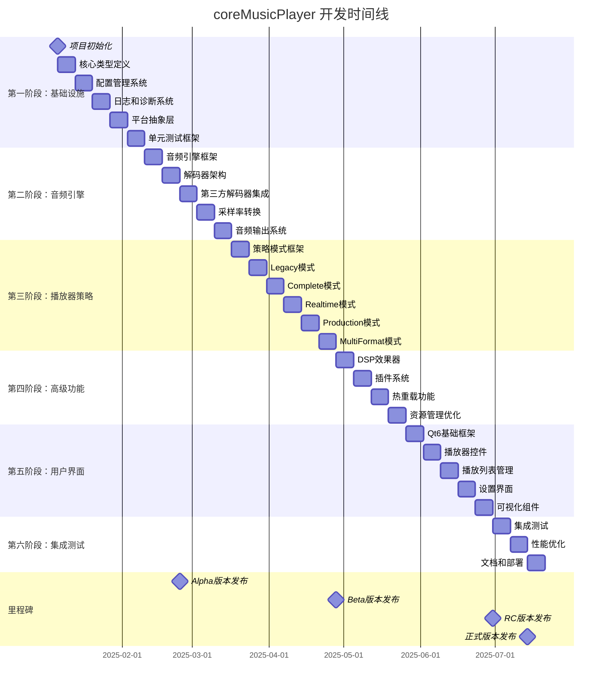
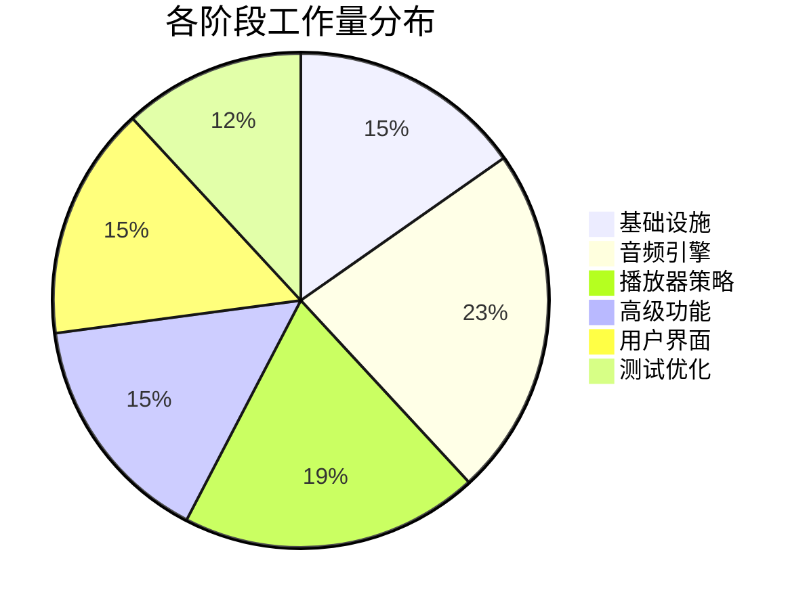
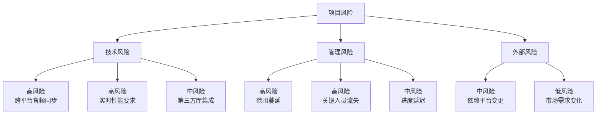

# coreMusicPlayer 项目管理计划

## 📊 项目概览仪表板

| 项目指标 | 目标值 | 当前值 | 状态 |
|---------|--------|--------|------|
| 项目总工期 | 26周 | 26周 | ✅ 计划中 |
| 团队规模 | 8人 | 8人 | ✅ 计划中 |
| 预算估算 | $1.2M | $1.2M | ✅ 计划中 |
| 功能模块 | 15个 | 15个 | ✅ 计划中 |
| 代码行数预估 | ~150K行 | - | ⏳ 待开发 |

## 🗓️ 开发时间线（甘特图视图）



## 📈 进度跟踪矩阵

### 第一阶段 - 基础设施 (Week 1-4)

| 任务 | 状态 | 负责人 | 开始日期 | 结束日期 | 工时(小时) | 完成度 | 依赖项 |
|------|------|--------|----------|----------|------------|--------|--------|
| 项目初始化 | ✅ 已完成 | PM | 2025-01-06 | 2025-01-10 | 40 | 100% | - |
| 核心类型定义 | ✅ 已完成 | 架构师 | 2025-01-06 | 2025-01-13 | 56 | 100% | 项目初始化 |
| 配置管理系统 | ✅ 已完成 | 架构师 | 2025-01-13 | 2025-01-20 | 40 | 100% | 核心类型定义 |
| 日志和诊断系统 | ✅ 已完成 | 音频开发者 | 2025-01-20 | 2025-01-27 | 40 | 100% | 配置管理 |
| 平台抽象层 | ✅ 已完成 | 音频开发者 | 2025-01-27 | 2025-02-03 | 40 | 100% | 日志系统 |
| 单元测试框架 | ✅ 已完成 | 测试工程师 | 2025-02-03 | 2025-02-10 | 40 | 100% | 平台抽象 |

### 第二阶段 - 音频引擎 (Week 5-10)

| 任务 | 状态 | 负责人 | 开始日期 | 结束日期 | 工时(小时) | 完成度 | 依赖项 |
|------|------|--------|----------|----------|------------|--------|--------|
| 音频引擎框架 | ✅ 已完成 | 音频开发者A | 2025-02-10 | 2025-02-24 | 80 | 100% | 测试框架 |
| 解码器架构 | ✅ 已完成 | 音频开发者B | 2025-02-17 | 2025-02-24 | 56 | 100% | 引擎框架 |
| 第三方解码器 | ✅ 已完成 | 音频开发者A | 2025-02-24 | 2025-03-10 | 80 | 100% | 解码器架构 |
| 采样率转换 | ✅ 已完成 | 音频开发者B | 2025-03-10 | 2025-03-24 | 80 | 100% | 第三方解码器 |
| 音频输出系统 | ✅ 已完成 | 音频开发者A | 2025-03-24 | 2025-04-07 | 80 | 100% | 采样率转换 |

## 👥 团队资源分配

### 技能矩阵

| 成员 | C++17 | 音频处理 | Qt6 | SIMD | 跨平台 | 测试 | 文档 |
|------|-------|----------|-----|------|--------|------|------|
| 音频开发者A | ⭐⭐⭐⭐ | ⭐⭐⭐⭐⭐ | ⭐⭐⭐ | ⭐⭐⭐⭐ | ⭐⭐⭐⭐ | ⭐⭐⭐ | ⭐⭐ |
| 音频开发者B | ⭐⭐⭐⭐ | ⭐⭐⭐⭐⭐ | ⭐⭐ | ⭐⭐⭐⭐⭐ | ⭐⭐⭐⭐ | ⭐⭐ | ⭐⭐ |
| 系统架构师 | ⭐⭐⭐⭐⭐ | ⭐⭐⭐ | ⭐⭐⭐ | ⭐⭐⭐⭐ | ⭐⭐⭐⭐⭐ | ⭐⭐⭐⭐ | ⭐⭐⭐⭐ |
| GUI开发者 | ⭐⭐⭐⭐ | ⭐⭐ | ⭐⭐⭐⭐⭐ | ⭐⭐ | ⭐⭐⭐ | ⭐⭐⭐⭐ | ⭐⭐⭐ |
| 测试工程师 | ⭐⭐⭐ | ⭐⭐⭐ | ⭐⭐⭐ | ⭐⭐ | ⭐⭐⭐ | ⭐⭐⭐⭐⭐ | ⭐⭐⭐⭐ |

### 工作负荷计划



## 💰 预算管理

### 成本明细

| 类别 | 项目 | 单价 | 数量 | 总计 | 备注 |
|------|------|------|------|------|------|
| **人力成本** | 项目经理 | $120/小时 | 2080小时 | $249,600 | 26周全时 |
|  | 音频开发者(2) | $100/小时 | 4160小时 | $416,000 | 26周全时 |
|  | 系统架构师 | $130/小时 | 2080小时 | $270,400 | 26周全时 |
|  | GUI开发者 | $90/小时 | 2080小时 | $187,200 | 26周全时 |
|  | 测试工程师 | $80/小时 | 2080小时 | $166,400 | 26周全时 |
|  | DevOps工程师 | $85/小时 | 1040小时 | $88,400 | 26周半时 |
|  | 文档工程师 | $75/小时 | 1040小时 | $78,000 | 26周半时 |
| **硬件成本** | 开发工作站 | $2,500/台 | 8台 | $20,000 | 高性能开发机 |
|  | 测试设备 | $1,000/台 | 10台 | $10,000 | 多平台测试 |
| **软件许可** | 开发工具 | $500/席位 | 8席位 | $4,000 | IDE、分析工具等 |
|  | Qt商业许可 | $300/席位 | 8席位 | $2,400 | Qt6商业版 |
| **基础设施** | 云服务 | $500/月 | 6个月 | $3,000 | CI/CD、存储 |
|  | 服务器托管 | $200/月 | 12个月 | $2,400 | 构建服务器 |
| **其他** | 培训费用 | $5,000/人 | 8人 | $40,000 | 技术培训 |
|  | 差旅费用 | - | - | $15,000 | 会议、调研 |
| **总计** | | | | **$1,552,400** | |

## 🚨 风险监控仪表板

### 风险热力图



### 风险响应计划

| 风险ID | 风险描述 | 概率 | 影响 | 风险等级 | 响应策略 | 负责人 | 状态 |
|--------|----------|------|------|----------|----------|--------|------|
| R001 | 跨平台音频延迟差异 | 中 | 高 | 🔴 高 | 早期原型验证 | 音频开发者A | 🔄 监控中 |
| R002 | 无法满足10ms延迟 | 低 | 高 | 🟡 中 | SIMD优化 | 音频开发者B | 🔄 监控中 |
| R003 | 插件系统安全漏洞 | 中 | 高 | 🔴 高 | 沙箱机制 | 架构师 | 🔄 监控中 |
| R004 | 功能需求增加 | 高 | 中 | 🟡 中 | MVP优先 | PM | 🔄 监控中 |
| R005 | 关键开发者离职 | 低 | 高 | 🟡 中 | 知识文档化 | PM | 🔄 监控中 |

## 📊 质量指标监控

### 代码质量目标

| 指标 | 目标值 | 测量频率 | 工具 | 当前值 | 趋势 |
|------|--------|----------|------|--------|------|
| 代码覆盖率 | ≥80% | 每周 | gcov/lcov | - | - |
| 静态分析警告 | 0 | 每日 | clang-tidy | - | - |
| 内存泄漏 | 0 | 每日 | Valgrind | - | - |
| 代码审查率 | 100% | 每PR | Gerrit/GitHub | - | - |
| 单元测试通过率 | 100% | 每日 | Google Test | - | - |

### 性能基准

| 性能指标 | 目标值 | Alpha目标 | Beta目标 | Release目标 | 测试方法 |
|----------|--------|-----------|----------|--------------|----------|
| 实时模式延迟 | <10ms | <20ms | <15ms | <10ms | 延迟测试工具 |
| CPU使用率 | <5% | <10% | <7% | <5% | 性能计数器 |
| 内存占用 | <100MB | <200MB | <150MB | <100MB | 内存分析器 |
| 启动时间 | <2秒 | <5秒 | <3秒 | <2秒 | 启动计时器 |
| 文件加载时间 | <100ms | <500ms | <200ms | <100ms | 加载测试 |

## 📋 每周站会模板

### 周一计划会议 (30分钟)

**议程**：
1. 上周回顾 (10分钟)
   - 完成的任务
   - 遇到的问题
   - 周末部署状态

2. 本周计划 (15分钟)
   - 重点任务
   - 里程碑目标
   - 风险识别

3. 资源协调 (5分钟)
   - 人员调配
   - 依赖管理
   - 支持需求

### 每日站会 (15分钟)

**三个问题**：
- 昨天完成了什么？
- 今天计划做什么？
- 遇到了什么阻碍？

### 周五回顾会议 (30分钟)

**议程**：
1. 里程碑进度检查
2. 质量指标评估
3. 风险状态更新
4. 下周计划确认

## 🔄 变更管理流程

### 变更请求模板

```
CR-YYYY-MM-DD-XXX

标题：[模块] 简要描述变更内容

影响评估：
- [ ] 功能变更
- [ ] 性能影响
- [ ] 时间线影响
- [ ] 成本影响
- [ ] 风险评估

变更原因：
[详细描述变更的背景和必要性]

实施方案：
[详细的实施步骤和时间计划]

验收标准：
[明确的验收条件和测试要求]

审批：
- 技术负责人：__________________
- 项目经理：____________________
- 产品负责人：__________________
```

### 变更控制委员会 (CCB)

**成员**：
- 项目经理 (主席)
- 系统架构师
- 音频技术负责人
- GUI技术负责人
- 测试负责人

**会议频率**：每周三下午

**决策机制**：
- 一般变更：简单多数通过
- 重大变更：全体一致通过
- 紧急变更：主席决策，事后追认

## 📈 项目健康度评分

### 健康度指标 (每月更新)

| 类别 | 权重 | 得分 | 加权分 | 评估维度 |
|------|------|------|--------|----------|
| 进度管理 | 25% | - | - | 里程碑达成率 |
| 质量控制 | 25% | - | - | 缺陷密度、测试覆盖率 |
| 团队效能 | 20% | - | - | 迭代速度、团队满意度 |
| 技术风险 | 15% | - | - | 风险数量、风险等级 |
| 成本控制 | 15% | - | - | 预算执行率 |
| **总分** | **100%** | | | |

### 健康度等级

- **90-100分** 🟢 绿色：项目健康
- **80-89分** 🟡 黄色：需要关注
- **70-79分** 🟠 橙色：需要干预
- **<70分** 🔴 红色：需要纠正

## 📱 沟通计划

### 沟通矩阵

| 干系人 | 频率 | 方式 | 内容 | 负责人 |
|--------|------|------|------|--------|
| 开发团队 | 每日 | 站会 | 进度、问题 | PM |
| 管理层 | 每周 | 报告 | 状态、风险 | PM |
| 用户 | 每月 | 演示 | 功能展示 | PM |
| 技术顾问 | 双周 | 会议 | 架构评审 | 架构师 |

### 文档管理

- **代码仓库**：GitHub
- **文档平台**：Confluence
- **项目管理**：Jira
- **沟通工具**：Slack
- **设计文档**：Figma

---

**文档版本**：1.0
**创建日期**：2024年12月17日
**最后更新**：2024年12月17日
**负责人**：项目管理团队
**下次更新**：每周一