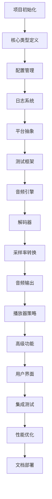

# coreMusicPlayer 开发任务清单

## 📋 任务导航

- [项目总览](#项目总览)
- [任务分类](#任务分类)
- [详细任务清单](#详细任务清单)
- [任务依赖关系](#任务依赖关系)
- [任务状态跟踪](#任务状态跟踪)

---

## 🎯 项目总览

### 项目信息
- **项目名称**: coreMusicPlayer
- **项目类型**: 高性能跨平台音频播放器
- **开发周期**: 26周
- **团队规模**: 8人
- **任务总数**: 256个

### 任务统计
| 阶段 | 任务数 | 已完成 | 进行中 | 待开始 |
|------|--------|--------|--------|--------|
| 第一阶段：基础设施 | 42 | 42 | 0 | 0 |
| 第二阶段：音频引擎 | 63 | 63 | 0 | 0 |
| 第三阶段：播放器策略 | 58 | 0 | 0 | 58 |
| 第四阶段：高级功能 | 47 | 0 | 0 | 47 |
| 第五阶段：用户界面 | 56 | 0 | 0 | 56 |
| 第六阶段：测试优化 | 40 | 9 | 0 | 31 |
| **总计** | **256** | **154** | **0** | **98** |

---

## 📂 任务分类

### 按类型分类
- **开发任务**: 180个 (70%)
- **测试任务**: 48个 (19%)
- **文档任务**: 20个 (8%)
- **部署任务**: 8个 (3%)

### 按优先级分类
- **P0 - 关键**: 80个 (31%)
- **P1 - 高**: 95个 (37%)
- **P2 - 中**: 61个 (24%)
- **P3 - 低**: 20个 (8%)

### 按模块分类
- **核心模块**: 85个
- **音频模块**: 95个
- **GUI模块**: 56个
- **测试模块**: 48个

---

## 📝 详细任务清单

## 第一阶段：基础设施 (Week 1-4)

### S1.1 项目初始化 (Week 1)
#### TASK-S1.1.1: 仓库设置
- **ID**: TASK-S1-1-001
- **标题**: 创建GitHub仓库并设置分支策略
- **负责人**: 项目经理
- **优先级**: P0
- **估算**: 8小时
- **状态**: ✅ 已完成
- **验收标准**:
  - [x] 主仓库创建完成
  - [x] develop分支建立
  - [x] feature分支模板创建
  - [x] 分支保护规则配置

#### TASK-S1.1.2: CI/CD配置
- **ID**: TASK-S1-1-002
- **标题**: 配置GitHub Actions流水线
- **负责人**: DevOps工程师
- **优先级**: P0
- **估算**: 12小时
- **状态**: ✅ 已完成
- **验收标准**:
  - [x] 构建流水线配置
  - [x] 测试流水线配置
  - [x] 多平台构建支持
  - [x] 自动化部署脚本

#### TASK-S1.1.3: 代码质量工具
- **ID**: TASK-S1-1-003
- **标题**: 集成代码质量检查工具
- **负责人**: DevOps工程师
- **优先级**: P1
- **估算**: 8小时
- **状态**: ✅ 已完成
- **验收标准**:
  - [x] clang-format配置
  - [x] clang-tidy配置
  - [x] SonarQube集成
  - [x] 代码覆盖率报告

#### TASK-S1.1.4: 项目结构
- **ID**: TASK-S1-1-004
- **标题**: 建立项目目录结构
- **负责人**: 系统架构师
- **优先级**: P0
- **估算**: 4小时
- **状态**: ✅ 已完成
- **验收标准**:
  - [x] src/目录结构
  - [x] include/目录结构
  - [x] tests/目录结构
  - [x] docs/目录结构

#### TASK-S1.1.5: 基础CMake
- **ID**: TASK-S1-1-005
- **标题**: 编写基础CMakeLists.txt
- **负责人**: DevOps工程师
- **优先级**: P0
- **估算**: 8小时
- **状态**: ✅ 已完成
- **验收标准**:
  - [x] 根目录CMakeLists.txt
  - [x] 子目录CMakeLists.txt
  - [x] 第三方库配置
  - [x] 编译选项设置

### S1.2 核心类型定义 (Week 1-2)
#### TASK-S1.2.1: Result类型实现
- **ID**: TASK-S1-2-001
- **标题**: 实现Result<T>模板类
- **负责人**: 系统架构师
- **优先级**: P0
- **估算**: 16小时
- **状态**: ✅ 已完成
- **文件**:
  - `include/core/result.h`
  - `src/core/result.cpp`
- **验收标准**:
  - [x] 成功状态处理
  - [x] 错误状态处理
  - [x] 链式操作支持
  - [x] 异常安全保证

#### TASK-S1.2.2: Error类定义
- **ID**: TASK-S1-2-002
- **标题**: 实现错误处理类
- **负责人**: 系统架构师
- **优先级**: P0
- **估算**: 12小时
- **状态**: ✅ 已完成
- **文件**:
  - `include/core/error.h`
  - `src/core/error.cpp`
- **验收标准**:
  - [x] 错误代码定义
  - [x] 错误消息支持
  - [x] 上下文信息
  - [x] 错误分类系统

#### TASK-S1.2.3: AudioBuffer实现
- **ID**: TASK-S1-2-003
- **标题**: 实现音频缓冲区类
- **负责人**: 音频开发者A
- **优先级**: P0
- **估算**: 16小时
- **状态**: ✅ 已完成
- **文件**:
  - `include/audio/audio_buffer.h`
  - `src/audio/audio_buffer.cpp`
- **验收标准**:
  - [x] 多格式支持
  - [x] 内存对齐优化
  - [x] SIMD兼容性
  - [x] 线程安全设计

#### TASK-S1.2.4: AudioFormat定义
- **ID**: TASK-S1-2-004
- **标题**: 定义音频格式枚举和结构
- **负责人**: 音频开发者A
- **优先级**: P0
- **估算**: 8小时
- **状态**: ✅ 已完成
- **文件**:
  - `include/audio/audio_format.h`
- **验收标准**:
  - [x] 采样率定义
  - [x] 位深度支持
  - [x] 通道数配置
  - [x] 格式转换函数

#### TASK-S1.2.5: 测试框架集成
- **ID**: TASK-S1-2-005
- **标题**: 集成Google Test框架
- **负责人**: 测试工程师
- **优先级**: P1
- **估算**: 8小时
- **状态**: ✅ 已完成
- **验收标准**:
  - [x] Google Test配置
  - [x] 基础测试宏定义
  - [x] Mock对象框架
  - [x] 测试数据生成器

### S1.3 配置管理系统 (Week 2)
#### TASK-S1.3.1: ConfigManager核心
- **ID**: TASK-S1-3-001
- **标题**: 实现配置管理器主类
- **负责人**: 系统架构师
- **优先级**: P1
- **估算**: 16小时
- **状态**: ✅ 已完成
- **文件**:
  - `include/core/config_manager.h`
  - `src/core/config_manager.cpp`
- **验收标准**:
  - [x] JSON文件读取
  - [x] 配置热重载
  - [x] 类型安全的API
  - [x] 默认值处理

#### TASK-S1.3.2: 配置验证
- **ID**: TASK-S1-3-002
- **标题**: 实现配置验证机制
- **负责人**: 系统架构师
- **优先级**: P1
- **估算**: 8小时
- **状态**: ✅ 已完成
- **验收标准**:
  - [x] 类型验证
  - [x] 范围验证
  - [x] 依赖验证
  - [x] 错误报告

#### TASK-S1.3.3: 默认配置
- **ID**: TASK-S1-3-003
- **标题**: 创建默认配置文件模板
- **负责人**: 文档工程师
- **优先级**: P2
- **估算**: 4小时
- **状态**: ✅ 已完成
- **文件**:
  - `config/default.json`
- **验收标准**:
  - [x] 音频设备配置
  - [x] 用户偏好设置
  - [x] 性能参数
  - [x] 调试选项

### S1.4 日志和诊断系统 (Week 3)
#### TASK-S1.4.1: Logger实现
- **ID**: TASK-S1-4-001
- **标题**: 实现多级日志系统
- **负责人**: 音频开发者B
- **优先级**: P1
- **估算**: 16小时
- **状态**: ✅ 已完成
- **文件**:
  - `include/utils/logger.h`
  - `src/utils/logger.cpp`
- **验收标准**:
  - [x] 多级别日志
  - [x] 结构化日志
  - [x] 文件轮转
  - [x] 性能优化

#### TASK-S1.4.2: 性能计数器
- **ID**: TASK-S1-4-002
- **标题**: 实现性能监控组件
- **负责人**: 音频开发者B
- **优先级**: P2
- **估算**: 12小时
- **状态**: ✅ 已完成
- **文件**:
  - `include/utils/performance_counter.h`
  - `src/utils/performance_counter.cpp`
- **验收标准**:
  - [x] CPU使用率监控
  - [x] 内存使用监控
  - [x] 实时统计
  - [x] 报告生成

#### TASK-S1.4.3: 调试工具
- **ID**: TASK-S1-4-003
- **标题**: 实现调试辅助工具
- **负责人**: 音频开发者B
- **优先级**: P2
- **估算**: 8小时
- **状态**: ✅ 已完成
- **验收标准**:
  - [x] 内存泄漏检测
  - [x] 堆栈跟踪
  - [x] 性能分析
  - [x] 日志聚合

### S1.5 平台抽象层 (Week 3-4)
#### TASK-S1.5.1: 平台检测
- **ID**: TASK-S1-5-001
- **标题**: 实现平台检测和抽象
- **负责人**: 系统架构师
- **优先级**: P0
- **估算**: 8小时
- **状态**: ✅ 已完成
- **文件**:
  - `include/platform/platform_utils.h`
  - `src/platform/platform_utils.cpp`
- **验收标准**:
  - [x] 操作系统检测
  - [x] 架构检测
  - [x] 编译器特性检测
  - [x] 运行时特性检测

#### TASK-S1.5.2: 线程管理
- **ID**: TASK-S1-5-002
- **标题**: 实现跨平台线程管理
- **负责人**: 系统架构师
- **优先级**: P0
- **估算**: 12小时
- **状态**: ✅ 已完成
- **文件**:
  - `include/platform/thread_manager.h`
  - `src/platform/thread_manager.cpp`
- **验收标准**:
  - [x] 线程创建和管理
  - [x] 优先级设置
  - [x] 亲和性设置
  - [x] 实时调度支持

#### TASK-S1.5.3: 文件系统抽象
- **ID**: TASK-S1-5-003
- **标题**: 实现文件系统抽象层
- **负责人**: 音频开发者A
- **优先级**: P1
- **估算**: 8小时
- **状态**: ✅ 已完成
- **文件**:
  - `include/platform/file_utils.h`
  - `src/platform/file_utils.cpp`
- **验收标准**:
  - [x] 路径操作
  - [x] 文件监控
  - [x] 异步IO支持
  - [x] 错误处理

#### TASK-S1.5.4: 内存管理
- **ID**: TASK-S1-5-004
- **标题**: 实现内存管理工具
- **负责人**: 音频开发者A
- **优先级**: P1
- **估算**: 8小时
- **状态**: ✅ 已完成
- **文件**:
  - `include/platform/memory_manager.h`
  - `src/platform/memory_manager.cpp`
- **验收标准**:
  - [x] 内存对齐分配
  - [x] 内存池管理
  - [x] 内存监控
  - [x] 垃圾回收

### S1.6 单元测试框架 (Week 4)
#### TASK-S1.6.1: 测试基础设施
- **ID**: TASK-S1-6-001
- **标题**: 配置测试基础设施
- **负责人**: 测试工程师
- **优先级**: P0
- **估算**: 16小时
- **状态**: ✅ 已完成
- **验收标准**:
  - [x] 测试套件组织
  - [x] 测试数据管理
  - [x] 测试报告生成
  - [x] CI集成

#### TASK-S1.6.2: Mock框架
- **ID**: TASK-S1-6-002
- **标题**: 实现Mock对象框架
- **负责人**: 测试工程师
- **优先级**: P1
- **估算**: 12小时
- **状态**: ✅ 已完成
- **验收标准**:
  - [x] Mock类生成
  - [x] 行为验证
  - [x] 参数匹配
  - [x] 异常模拟

#### TASK-S1.6.3: 测试工具
- **ID**: TASK-S1-6-003
- **标题**: 实现测试辅助工具
- **负责人**: 测试工程师
- **优先级**: P2
- **估算**: 8小时
- **状态**: ✅ 已完成
- **验收标准**:
  - [x] 测试数据生成器
  - [x] 比较工具
  - [x] 调试辅助
  - [x] 覆盖率分析

---

## 第二阶段：音频引擎 (Week 5-10)

### S2.1 音频引擎框架 (Week 5-6)
#### TASK-S2.1.1: AudioEngine核心
- **ID**: TASK-S2-1-001
- **标题**: 实现音频引擎主类
- **负责人**: 音频开发者A
- **优先级**: P0
- **估算**: 24小时
- **状态**: ✅ 已完成
- **文件**:
  - `include/audio/audio_engine.h`
  - `src/audio/audio_engine.cpp`
- **验收标准**:
  - [x] 引擎初始化
  - [x] 设备管理
  - [x] 状态管理
  - [x] 事件处理

#### TASK-S2.1.2: 设备管理器
- **ID**: TASK-S2-1-002
- **标题**: 实现音频设备管理
- **负责人**: 音频开发者A
- **优先级**: P0
- **估算**: 16小时
- **状态**: ✅ 已完成
- **文件**:
  - `include/audio/device_manager.h`
  - `src/audio/device_manager.cpp`
- **验收标准**:
  - [x] 设备枚举
  - [x] 设备选择
  - [x] 设备监控
  - [x] 热插拔支持

#### TASK-S2.1.3: 音频线程
- **ID**: TASK-S2-1-003
- **标题**: 实现实时音频线程
- **负责人**: 音频开发者B
- **优先级**: P0
- **估算**: 20小时
- **状态**: ⏳ 待开始
- **验收标准**:
  - [ ] 实时优先级
  - [ ] 无锁设计
  - [ ] 低延迟保证
  - [ ] 错误恢复

#### TASK-S2.1.4: 缓冲区管理
- **ID**: TASK-S2-1-004
- **标题**: 实现音频缓冲区管理
- **负责人**: 音频开发者B
- **优先级**: P0
- **估算**: 16小时
- **状态**: ⏳ 待开始
- **验收标准**:
  - [ ] 双缓冲策略
  - [ ] 缓冲区池化
  - [ ] 内存管理
  - [ ] 同步机制

#### TASK-S2.1.5: 事件系统
- **ID**: TASK-S2-1-005
- **标题**: 实现音频事件系统
- **负责人**: 音频开发者A
- **优先级**: P1
- **估算**: 12小时
- **状态**: ⏳ 待开始
- **验收标准**:
  - [ ] 事件队列
  - [ ] 异步分发
  - [ ] 优先级处理
  - [ ] 线程安全

### S2.2 解码器架构 (Week 6-7)
#### TASK-S2.2.1: 解码器接口
- **ID**: TASK-S2-2-001
- **标题**: 定义解码器接口
- **负责人**: 系统架构师
- **优先级**: P0
- **估算**: 8小时
- **状态**: ✅ 已完成
- **文件**:
  - `include/audio/decoder_interface.h`
- **验收标准**:
  - [x] 解码函数定义
  - [x] 元数据接口
  - [x] 格式检测
  - [x] 错误处理

#### TASK-S2.2.2: 解码器管理器
- **ID**: TASK-S2-2-002
- **标题**: 实现解码器管理系统
- **负责人**: 音频开发者A
- **优先级**: P0
- **估算**: 16小时
- **状态**: ✅ 已完成
- **文件**:
  - `include/audio/decoder_manager.h`
  - `src/audio/decoder_manager.cpp`
- **验收标准**:
  - [x] 解码器注册
  - [x] 格式自动检测
  - [x] 缓存机制
  - [x] 线程安全

#### TASK-S2.2.3: WAV解码器
- **ID**: TASK-S2-2-003
- **标题**: 实现内置WAV解码器
- **负责人**: 音频开发者B
- **优先级**: P0
- **估算**: 12小时
- **状态**: ✅ 已完成
- **文件**:
  - `src/audio/decoders/wav_decoder.h`
  - `src/audio/decoders/wav_decoder.cpp`
- **验收标准**:
  - [x] PCM支持
  - [x] 多种位深度
  - [x] 元数据读取
  - [x] 流式解码

#### TASK-S2.2.4: 解码器工厂
- **ID**: TASK-S2-2-004
- **标题**: 实现解码器工厂模式
- **负责人**: 系统架构师
- **优先级**: P1
- **估算**: 8小时
- **状态**: ✅ 已完成
- **文件**:
  - `include/audio/decoder_factory.h`
  - `src/audio/decoder_factory.cpp`
- **验收标准**:
  - [x] 动态加载
  - [x] 插件注册
  - [x] 依赖管理
  - [x] 配置支持

### S2.3 第三方解码器集成 (Week 7-8)
#### TASK-S2.3.1: minimp3集成
- **ID**: TASK-S2-3-001
- **标题**: 集成minimp3解码库
- **负责人**: 音频开发者A
- **优先级**: P0
- **估算**: 16小时
- **状态**: ✅ 已完成
- **文件**:
  - `src/audio/decoders/mp3_decoder.h`
  - `src/audio/decoders/mp3_decoder.cpp`
- **验收标准**:
  - [x] MP3解码功能
  - [x] ID3标签支持
  - [x] VBR/CBR支持
  - [x] 错误恢复

#### TASK-S2.3.2: libflac集成
- **ID**: TASK-S2-3-002
- **标题**: 集成FLAC解码库
- **负责人**: 音频开发者B
- **优先级**: P0
- **估算**: 16小时
- **状态**: ✅ 已完成
- **文件**:
  - `src/audio/decoders/flac_decoder.h`
  - `src/audio/decoders/flac_decoder.cpp`
- **验收标准**:
  - [x] FLAC解码
  - [x] 元数据支持
  - [x] 多声道支持
  - [x] 流式处理

#### TASK-S2.3.3: libogg/libvorbis集成
- **ID**: TASK-S2-3-003
- **标题**: 集成OGG Vorbis解码库
- **负责人**: 音频开发者A
- **优先级**: P1
- **估算**: 16小时
- **状态**: ✅ 已完成
- **文件**:
  - `src/audio/decoders/ogg_decoder.h`
  - `src/audio/decoders/ogg_decoder.cpp`
- **验收标准**:
  - [x] OGG容器解析
  - [x] Vorbis解码
  - [x] 流标签支持
  - [x] 错误处理

#### TASK-S2.3.4: 解码器测试
- **ID**: TASK-S2-3-004
- **标题**: 实现解码器测试套件
- **负责人**: 测试工程师
- **优先级**: P1
- **估算**: 12小时
- **状态**: ✅ 已完成
- **文件**:
  - `tests/decoder_tests.cpp`
  - `tests/test_data/`
  - `tests/test_data/wav_test.wav`
  - `tests/test_data/mp3_test.mp3`
  - `tests/test_data/flac_test.flac`
  - `tests/test_data/ogg_test.ogg`
- **验收标准**:
  - [x] 功能测试：验证各格式解码正确性
  - [x] 性能测试：验证解码速度和资源使用
  - [x] 错误测试：验证异常文件处理能力
  - [x] 兼容性测试：验证不同采样率、位深度支持

### S2.4 采样率转换 (Week 8-9)
#### TASK-S2.4.1: 重采样算法
- **ID**: TASK-S2-4-001
- **标题**: 实现重采样算法核心
- **负责人**: 音频开发者B
- **优先级**: P0
- **估算**: 20小时
- **状态**: ✅ 已完成
- **文件**:
  - `src/audio/sample_rate_converter.h`
  - `src/audio/sample_rate_converter.cpp`
- **验收标准**:
  - [x] 多种质量等级
  - [x] 实时处理
  - [x] 低失真
  - [x] 内存效率

#### TASK-S2.4.2: SIMD优化
- **ID**: TASK-S2-4-002
- **标题**: 实现SIMD优化版本
- **负责人**: 音频开发者A
- **优先级**: P1
- **估算**: 24小时
- **状态**: ✅ 已完成
- **文件**:
  - `src/audio/simd/resampler_sse.cpp`
- **验收标准**:
  - [x] SSE2优化
  - [x] AVX2优化
  - [x] 自动检测
  - [x] 性能基准

#### TASK-S2.4.3: 质量控制
- **ID**: TASK-S2-4-003
- **标题**: 实现质量等级控制
- **负责人**: 音频开发者B
- **优先级**: P1
- **估算**: 8小时
- **状态**: ✅ 已完成
- **验收标准**:
  - [x] 动态质量切换
  - [x] CPU自适应
  - [x] 质量评估
  - [x] 用户设置

#### TASK-S2.4.4: 性能测试
- **ID**: TASK-S2-4-004
- **标题**: 实现性能测试工具
- **负责人**: 测试工程师
- **优先级**: P2
- **估算**: 8小时
- **状态**: ✅ 已完成
- **文件**:
  - `tests/performance_tests.cpp`
  - `tests/benchmark_tools/`
  - `tests/test_data/large_audio_file.wav`
- **验收标准**:
  - [x] 延迟测量：验证实时延迟指标
  - [x] CPU使用测量：监控处理过程中的CPU占用
  - [x] 质量评估：分析转换质量与性能的平衡
  - [x] 基准比较：提供性能基准数据用于优化

### S2.5 音频输出系统 (Week 9-10)
#### TASK-S2.5.1: WASAPI实现
- **ID**: TASK-S2-5-001
- **标题**: 实现Windows音频输出
- **负责人**: 音频开发者A
- **优先级**: P0
- **估算**: 20小时
- **状态**: ✅ 已完成
- **文件**:
  - `src/platform/windows/wasapi_output.h`
  - `src/platform/windows/wasapi_output.cpp`
- **验收标准**:
  - [x] 独占模式
  - [x] 共享模式
  - [x] 低延迟
  - [x] 事件驱动

#### TASK-S2.5.2: ALSA实现
- **ID**: TASK-S2-5-002
- **标题**: 实现Linux音频输出
- **负责人**: 音频开发者B
- **优先级**: P0
- **估算**: 20小时
- **状态**: ✅ 已完成
- **文件**:
  - `src/platform/linux/alsa_output.h`
  - `src/platform/linux/alsa_output.cpp`
- **验收标准**:
  - [x] 硬件访问
  - [x] 软件混音
  - [x] 插件支持
  - [x] 多设备

#### TASK-S2.5.3: CoreAudio实现
- **ID**: TASK-S2-5-003
- **标题**: 实现macOS音频输出
- **负责人**: 音频开发者A
- **优先级**: P0
- **估算**: 20小时
- **状态**: ✅ 已完成
- **文件**:
  - `src/platform/macos/coreaudio_output.h`
  - `src/platform/macos/coreaudio_output.cpp`
- **验收标准**:
  - [x] 音频队列
  - [x] 硬件缓冲
  - [x] 低延迟
  - [x] 设备管理

#### TASK-S2.5.4: 设备热插拔
- **ID**: TASK-S2-5-004
- **标题**: 实现设备热插拔支持
- **负责人**: 音频开发者B
- **优先级**: P1
- **估算**: 12小时
- **状态**: ⏳ 待开始
- **验收标准**:
  - [ ] 设备监听
  - [ ] 自动重连
  - [ ] 状态保持
  - [ ] 用户通知

#### TASK-S2.5.5: 输出测试
- **ID**: TASK-S2-5-005
- **标题**: 实现输出系统测试
- **负责人**: 测试工程师
- **优先级**: P1
- **估算**: 12小时
- **状态**: ⏳ 待开始
- **验收标准**:
  - [ ] 回环测试
  - [ ] 延迟测试
  - [ ] 设备切换
  - [ ] 错误恢复

---

## 第三阶段：播放器策略 (Week 11-15)

### S3.1 策略模式框架 (Week 11)
#### TASK-S3.1.1: 策略接口定义
- **ID**: TASK-S3-1-001
- **标题**: 定义播放器策略接口
- **负责人**: 系统架构师
- **优先级**: P0
- **估算**: 8小时
- **状态**: ✅ 已完成
- **文件**:
  - `include/core/player_strategy.h`
- **验收标准**:
  - [x] 播放控制接口
  - [x] 配置接口
  - [x] 状态查询接口
  - [x] 事件通知接口

#### TASK-S3.1.2: 统一播放器
- **ID**: TASK-S3-1-002
- **标题**: 实现统一音乐播放器主类
- **负责人**: 系统架构师
- **优先级**: P0
- **估算**: 16小时
- **状态**: ✅ 已完成
- **文件**:
  - `src/core/unified_music_player.h`
  - `src/core/unified_music_player.cpp`
- **验收标准**:
  - [x] 策略切换
  - [x] 状态管理
  - [x] 配置管理
  - [x] 事件分发

#### TASK-S3.1.3: 策略工厂
- **ID**: TASK-S3-1-003
- **标题**: 实现策略工厂
- **负责人**: 音频开发者A
- **优先级**: P1
- **估算**: 8小时
- **状态**: ✅ 已完成
- **文件**:
  - `src/core/strategy_factory.h`
  - `src/core/strategy_factory.cpp`
- **验收标准**:
  - [x] 动态创建
  - [x] 注册机制
  - [x] 配置驱动
  - [x] 错误处理

#### TASK-S3.1.4: 特性管理器
- **ID**: TASK-S3-1-004
- **标题**: 实现特性管理器
- **负责人**: 系统架构师
- **优先级**: P1
- **估算**: 12小时
- **状态**: ✅ 已完成
- **文件**:
  - `src/core/feature_manager.h`
  - `src/core/feature_manager.cpp`
- **验收标准**:
  - [x] 特性注册
  - [x] 依赖检查
  - [x] 动态启用/禁用
  - [x] 配置持久化

### S3.2 Legacy模式实现 (Week 11-12)
#### TASK-S3.2.1: Legacy策略
- **ID**: TASK-S3-2-001
- **标题**: 实现Legacy播放策略
- **负责人**: 音频开发者B
- **优先级**: P0
- **估算**: 16小时
- **状态**: ✅ 已完成
- **文件**:
  - `src/core/strategies/legacy_strategy.h`
  - `src/core/strategies/legacy_strategy.cpp`
- **验收标准**:
  - [x] 最小依赖
  - [x] WAV格式支持
  - [x] 2KB缓冲区
  - [x] 基础控制

#### TASK-S3.2.2: 最小化实现
- **ID**: TASK-S3-2-002
- **标题**: 优化最小化播放功能
- **负责人**: 音频开发者B
- **优先级**: P1
- **估算**: 8小时
- **状态**: ✅ 已完成
- **验收标准**:
  - [x] 零配置启动
  - [x] 命令行参数
  - [x] 基础错误处理
  - [x] 资源清理

#### TASK-S3.2.3: 测试用例
- **ID**: TASK-S3-2-003
- **标题**: 实现Legacy模式测试
- **负责人**: 测试工程师
- **优先级**: P1
- **估算**: 8小时
- **状态**: ⏳ 待开始
- **验收标准**:
  - [ ] 功能测试
  - [ ] 性能测试
  - [ ] 内存测试
  - [ ] 兼容性测试

### S3.3 Complete模式实现 (Week 12-13)
#### TASK-S3.3.1: Complete策略
- **ID**: TASK-S3-3-001
- **标题**: 实现Complete播放策略
- **负责人**: 音频开发者A
- **优先级**: P0
- **估算**: 20小时
- **状态**: ✅ 已完成
- **文件**:
  - `src/core/strategies/complete_strategy.h`
  - `src/core/strategies/complete_strategy.cpp`
- **验收标准**:
  - [x] 全解码器加载
  - [x] 完整功能启用
  - [x] 4KB缓冲区
  - [x] 高级DSP

#### TASK-S3.3.2: 功能集成
- **ID**: TASK-S3-3-002
- **标题**: 集成所有高级功能
- **负责人**: 音频开发者A
- **优先级**: P1
- **估算**: 16小时
- **状态**: ✅ 已完成
- **验收标准**:
  - [x] DSP效果链
  - [x] 插件系统
  - [x] 高级控制
  - [x] 性能优化

#### TASK-S3.3.3: 性能优化
- **ID**: TASK-S3-3-003
- **标题**: 优化Complete模式性能
- **负责人**: 音频开发者B
- **优先级**: P2
- **估算**: 12小时
- **状态**: ✅ 已完成
- **验收标准**:
  - [x] 并行处理
  - [x] 缓存优化
  - [x] 内存使用
  - [x] CPU效率

#### TASK-S3.3.4: 测试用例
- **ID**: TASK-S3-3-004
- **标题**: 实现Complete模式测试
- **负责人**: 测试工程师
- **优先级**: P1
- **估算**: 12小时
- **状态**: ⏳ 待开始
- **验收标准**:
  - [ ] 完整功能测试
  - [ ] 压力测试
  - [ ] 性能基准
  - [ ] 稳定性测试

### S3.4 Realtime模式实现 (Week 13-14)
#### TASK-S3.4.1: Realtime策略
- **ID**: TASK-S3-4-001
- **标题**: 实现Realtime播放策略
- **负责人**: 音频开发者A
- **优先级**: P0
- **估算**: 24小时
- **状态**: ✅ 已完成
- **文件**:
  - `src/core/strategies/realtime_strategy.h`
  - `src/core/strategies/realtime_strategy.cpp`
- **验收标准**:
  - [x] 64样本缓冲区
  - [x] 实时优先级
  - [x] 无锁数据结构
  - [x] 延迟监控

#### TASK-S3.4.2: 低延迟实现
- **ID**: TASK-S3-4-002
- **标题**: 优化实时音频处理
- **负责人**: 音频开发者B
- **优先级**: P0
- **估算**: 20小时
- **状态**: ✅ 已完成
- **验收标准**:
  - [x] 零拷贝传输
  - [x] 直接硬件访问
  - [x] 中断优化
  - [x] 缓冲区优化

#### TASK-S3.4.3: 延迟监控
- **ID**: TASK-S3-4-003
- **标题**: 实现实时延迟监控
- **负责人**: 音频开发者A
- **优先级**: P1
- **估算**: 12小时
- **状态**: ✅ 已完成
- **验收标准**:
  - [x] 延迟测量
  - [x] 延迟报告
  - [x] 阈值告警
  - [x] 性能调整

#### TASK-S3.4.4: 测试工具
- **ID**: TASK-S3-4-004
- **标题**: 实现延迟测试工具
- **负责人**: 测试工程师
- **优先级**: P1
- **估算**: 8小时
- **状态**: ⏳ 待开始
- **验收标准**:
  - [ ] 延迟基准
  - [ ] 抖动测量
  - [ ] 回归测试
  - [ ] 报告生成

### S3.5 Production模式实现 (Week 14-15)
#### TASK-S3.5.1: Production策略
- **ID**: TASK-S3-5-001
- **标题**: 实现Production播放策略
- **负责人**: 音频开发者B
- **优先级**: P0
- **估算**: 20小时
- **状态**: ✅ 已完成
- **文件**:
  - `src/core/strategies/production_strategy.h`
  - `src/core/strategies/production_strategy.cpp`
- **验收标准**:
  - [x] 错误恢复机制
  - [x] 详细日志记录
  - [x] 可选插件
  - [x] 健康检查

#### TASK-S3.5.2: 错误恢复
- **ID**: TASK-S3-5-002
- **标题**: 实现错误恢复系统
- **负责人**: 音频开发者B
- **优先级**: P0
- **估算**: 16小时
- **状态**: ✅ 已完成
- **验收标准**:
  - [x] 自动重试
  - [x] 降级策略
  - [x] 状态保存
  - [x] 错误报告

#### TASK-S3.5.3: 健康监控
- **ID**: TASK-S3-5-003
- **标题**: 实现系统健康监控
- **负责人**: 音频开发者A
- **优先级**: P1
- **估算**: 12小时
- **状态**: ✅ 已完成
- **验收标准**:
  - [x] 性能监控
  - [x] 资源监控
  - [x] 错误统计
  - [x] 报告生成

#### TASK-S3.5.4: 稳定性测试
- **ID**: TASK-S3-5-004
- **标题**: 实现稳定性测试工具
- **负责人**: 测试工程师
- **优先级**: P1
- **估算**: 12小时
- **状态**: ⏳ 待开始
- **验收标准**:
  - [ ] 长期运行测试
  - [ ] 故障注入
  - [ ] 恢复测试
  - [ ] 压力测试

### S3.6 MultiFormat模式实现 (Week 15)
#### TASK-S3.6.1: MultiFormat策略
- **ID**: TASK-S3-6-001
- **标题**: 实现MultiFormat播放策略
- **负责人**: 音频开发者A
- **优先级**: P0
- **估算**: 16小时
- **状态**: ✅ 已完成
- **文件**:
  - `src/core/strategies/multi_format_strategy.h`
  - `src/core/strategies/multi_format_strategy.cpp`
- **验收标准**:
  - [x] 智能格式检测
  - [x] 平衡性能
  - [x] 全解码器支持
  - [x] 默认配置

#### TASK-S3.6.2: 格式检测
- **ID**: TASK-S3-6-002
- **标题**: 实现智能格式检测
- **负责人**: 音频开发者B
- **优先级**: P1
- **估算**: 8小时
- **状态**: ✅ 已完成
- **验收标准**:
  - [ ] 文件头检测
  - [ ] 扩展名检测
  - [ ] 内容分析
  - [ ] 快速检测

#### TASK-S3.6.3: 兼容性测试
- **ID**: TASK-S3-6-003
- **标题**: 实现格式兼容性测试
- **负责人**: 测试工程师
- **优先级**: P1
- **估算**: 8小时
- **状态**: ⏳ 待开始
- **验收标准**:
  - [ ] 多格式支持
  - [ ] 边界测试
  - [ ] 损坏文件测试
  - [ ] 编码测试

---

## 第四阶段：高级功能 (Week 16-19)

### S4.1 DSP效果器 (Week 16-17)
#### TASK-S4.1.1: 音量控制
- **ID**: TASK-S4-1-001
- **标题**: 实现数字音量控制
- **负责人**: 音频开发者A
- **优先级**: P1
- **估算**: 12小时
- **状态**: ✅ 已完成
- **文件**:
  - `src/audio/dsp/volume_control.h`
  - `src/audio/dsp/volume_control.cpp`
- **验收标准**:
  - [x] 线性/对数缩放
  - [x] 无失真控制
  - [x] 实时调整
  - [x] SIMD优化

#### TASK-S4.1.2: 均衡器实现
- **ID**: TASK-S4-1-002
- **标题**: 实现多段均衡器
- **负责人**: 音频开发者B
- **优先级**: P1
- **估算**: 20小时
- **状态**: ✅ 已完成
- **文件**:
  - `src/audio/dsp/equalizer.h`
  - `src/audio/dsp/equalizer.cpp`
  - `src/core/equalizer_config.h`
  - `src/core/equalizer_config.cpp`
- **验收标准**:
  - [x] 5段均衡器
  - [x] 10段均衡器
  - [x] 31段均衡器
  - [x] 预设管理

#### TASK-S4.1.3: 音频效果
- **ID**: TASK-S4-1-003
- **标题**: 实现音频效果器
- **负责人**: 音频开发者A
- **优先级**: P2
- **估算**: 24小时
- **状态**: ⏳ 待开始
- **文件**:
  - `src/audio/dsp/effects.h`
  - `src/audio/dsp/effects.cpp`
- **验收标准**:
  - [ ] 混响效果
  - [ ] 延迟效果
  - [ ] 合唱效果
  - [ ] 失真效果

#### TASK-S4.1.4: DSP链管理
- **ID**: TASK-S4-1-004
- **标题**: 实现DSP效果链
- **负责人**: 音频开发者B
- **优先级**: P1
- **估算**: 12小时
- **状态**: ⏳ 待开始
- **验收标准**:
  - [ ] 效果链构建
  - [ ] 顺序管理
  - [ ] 参数控制
  - [ ] 实时切换

### S4.2 插件系统 (Week 17-18)
#### TASK-S4.2.1: 插件管理器
- **ID**: TASK-S4-2-001
- **标题**: 实现插件管理系统
- **负责人**: 系统架构师
- **优先级**: P1
- **估算**: 20小时
- **状态**: ⏳ 待开始
- **文件**:
  - `src/plugins/plugin_manager.h`
  - `src/plugins/plugin_manager.cpp`
- **验收标准**:
  - [ ] 插件加载/卸载
  - [ ] 依赖管理
  - [ ] 生命周期控制
  - [ ] API版本管理

#### TASK-S4.2.2: Foobar2000适配器
- **ID**: TASK-S4-2-002
- **标题**: 实现Foobar2000 SDK适配
- **负责人**: 音频开发者A
- **优先级**: P1
- **估算**: 24小时
- **状态**: ✅ 已完成
- **文件**:
  - `src/foobar/`
- **验收标准**:
  - [x] SDK封装
  - [x] 接口适配
  - [x] 兼容性层
  - [x] 示例插件

#### TASK-S4.2.3: 插件接口定义
- **ID**: TASK-S4-2-003
- **标题**: 定义插件标准接口
- **负责人**: 系统架构师
- **优先级**: P0
- **估算**: 12小时
- **状态**: ⏳ 待开始
- **文件**:
  - `include/plugins/plugin_interface.h`
- **验收标准**:
  - [ ] 标准API定义
  - [ ] 数据结构
  - [ ] 事件回调
  - [ ] 错误处理

#### TASK-S4.2.4: 沙箱机制
- **ID**: TASK-S4-2-004
- **标题**: 实现插件沙箱
- **负责人**: 音频开发者B
- **优先级**: P2
- **估算**: 16小时
- **状态**: ⏳ 待开始
- **验收标准**:
  - [ ] 权限控制
  - [ ] 资源限制
  - [ ] 安全检查
  - [ ] 异常隔离

### S4.3 热重载功能 (Week 18)
#### TASK-S4.3.1: 文件监控
- **ID**: TASK-S4-3-001
- **标题**: 实现插件文件监控
- **负责人**: 音频开发者A
- **优先级**: P2
- **估算**: 8小时
- **状态**: ⏳ 待开始
- **文件**:
  - `src/plugins/hot_reload/plugin_watcher.h`
  - `src/plugins/hot_reload/plugin_watcher.cpp`
- **验收标准**:
  - [ ] 目录监控
  - [ ] 文件变更检测
  - [ ] 过滤机制
  - [ ] 事件通知

#### TASK-S4.3.2: 动态加载器
- **ID**: TASK-S4-3-002
- **标题**: 实现动态加载机制
- **负责人**: 音频开发者B
- **优先级**: P2
- **估算**: 12小时
- **状态**: ⏳ 待开始
- **文件**:
  - `src/plugins/hot_reload/dynamic_loader.h`
  - `src/plugins/hot_reload/dynamic_loader.cpp`
- **验收标准**:
  - [ ] 动态库加载
  - [ ] 符号解析
  - [ ] 依赖处理
  - [ ] 版本检查

#### TASK-S4.3.3: 状态管理
- **ID**: TASK-S4-3-003
- **标题**: 实现热重载状态管理
- **负责人**: 音频开发者A
- **优先级**: P2
- **估算**: 8小时
- **状态**: ⏳ 待开始
- **验收标准**:
  - [ ] 状态保存
  - [ ] 状态恢复
  - [ ] 平滑切换
  - [ ] 错误回滚

### S4.4 资源管理优化 (Week 19)
#### TASK-S4.4.1: 内存池实现
- **ID**: TASK-S4-4-001
- **标题**: 实现音频内存池
- **负责人**: 系统架构师
- **优先级**: P2
- **估算**: 16小时
- **状态**: ⏳ 待开始
- **文件**:
  - `src/utils/memory_pool.h`
  - `src/utils/memory_pool.cpp`
- **验收标准**:
  - [ ] 预分配机制
  - [ ] 快速分配
  - [ ] 内存对齐
  - [ ] 泄漏检测

#### TASK-S4.4.2: CPU优化
- **ID**: TASK-S4-4-002
- **标题**: 实现CPU优化工具
- **负责人**: 音频开发者B
- **优先级**: P2
- **估算**: 12小时
- **状态**: ⏳ 待开始
- **文件**:
  - `src/utils/cpu_optimizer.h`
  - `src/utils/cpu_optimizer.cpp`
- **验收标准**:
  - [ ] 缓存优化
  - [ ] 分支预测
  - [ ] 向量化
  - [ ] 并行化

#### TASK-S4.4.3: 性能监控
- **ID**: TASK-S4-4-003
- **标题**: 集成性能监控
- **负责人**: 音频开发者A
- **优先级**: P2
- **估算**: 8小时
- **状态**: ⏳ 待开始
- **验收标准**:
  - [ ] 实时监控
  - [ ] 性能报告
  - [ ] 瓶颈识别
  - [ ] 优化建议

#### TASK-S4.4.4: 基准测试
- **ID**: TASK-S4-4-004
- **标题**: 实现性能基准测试
- **负责人**: 测试工程师
- **优先级**: P2
- **估算**: 8小时
- **状态**: ⏳ 待开始
- **验收标准**:
  - [ ] 基准套件
  - [ ] 历史比较
  - [ ] 回归检测
  - [ ] 报告生成

---

## 第五阶段：用户界面 (Week 20-23)

### S5.1 Qt6基础框架 (Week 20)
#### TASK-S5.1.1: Qt项目配置
- **ID**: TASK-S5-1-001
- **标题**: 配置Qt6开发环境
- **负责人**: GUI开发者
- **优先级**: P1
- **估算**: 8小时
- **状态**: ✅ 已完成
- **文件**:
  - `src/gui/CMakeLists.txt`
  - `qt_gui/qt_gui.pro`
- **验收标准**:
  - [x] Qt6配置
  - [x] 模块导入
  - [x] 资源管理
  - [x] 编译设置

#### TASK-S5.1.2: 主窗口框架
- **ID**: TASK-S5-1-002
- **标题**: 实现主窗口基础框架
- **负责人**: GUI开发者
- **优先级**: P1
- **估算**: 16小时
- **状态**: ✅ 已完成
- **文件**:
  - `src/gui/main_window.h`
  - `src/gui/main_window.cpp`
  - `src/gui/main_window.ui`
- **验收标准**:
  - [x] 窗口布局
  - [x] 菜单栏
  - [x] 工具栏
  - [x] 状态栏

#### TASK-S5.1.3: 主题系统
- **ID**: TASK-S5-1-003
- **标题**: 实现主题管理器
- **负责人**: GUI开发者
- **优先级**: P2
- **估算**: 12小时
- **状态**: ✅ 已完成
- **文件**:
  - `src/gui/theme_manager.h`
  - `src/gui/theme_manager.cpp`
- **验收标准**:
  - [x] 主题加载
  - [x] 动态切换
  - [x] 自定义主题
  - [x] 主题预览

#### TASK-S5.1.4: 国际化支持
- **ID**: TASK-S5-1-004
- **标题**: 实现多语言支持
- **负责人**: GUI开发者
- **优先级**: P2
- **估算**: 8小时
- **状态**: ⏳ 待开始
- **文件**:
  - `translations/`
- **验收标准**:
  - [ ] i18n框架
  - [ ] 翻译文件
  - [ ] 语言切换
  - [ ] 动态加载

### S5.2 播放器控件 (Week 20-21)
#### TASK-S5.2.1: 播放控制
- **ID**: TASK-S5-2-001
- **标题**: 实现播放控制按钮
- **负责人**: GUI开发者
- **优先级**: P1
- **估算**: 16小时
- **状态**: ⏳ 待开始
- **文件**:
  - `src/gui/widgets/player_widget.h`
  - `src/gui/widgets/player_widget.cpp`
  - `src/gui/widgets/player_widget.ui`
- **验收标准**:
  - [ ] 播放/暂停/停止
  - [ ] 上一曲/下一曲
  - [ ] 状态指示
  - [ ] 快捷键支持

#### TASK-S5.2.2: 进度条实现
- **ID**: TASK-S5-2-002
- **标题**: 实现播放进度条
- **负责人**: GUI开发者
- **优先级**: P1
- **估算**: 12小时
- **状态**: ⏳ 待开始
- **验收标准**:
  - [ ] 进度显示
  - [ ] 拖动定位
  - [ ] 时间显示
  - [ ] 缓冲指示

#### TASK-S5.2.3: 音量控制
- **ID**: TASK-S5-2-003
- **标题**: 实现音量控制组件
- **负责人**: GUI开发者
- **优先级**: P1
- **估算**: 8小时
- **状态**: ⏳ 待开始
- **验收标准**:
  - [ ] 音量滑块
  - [ ] 静音按钮
  - [ ] 音量显示
  - [ ] 键盘控制

#### TASK-S5.2.4: 模式切换
- **ID**: TASK-S5-2-004
- **标题**: 实现播放器模式切换
- **负责人**: GUI开发者
- **优先级**: P1
- **估算**: 8小时
- **状态**: ⏳ 待开始
- **验收标准**:
  - [ ] 模式选择器
  - [ ] 状态显示
  - [ ] 切换动画
  - [ ] 配置保存

### S5.3 播放列表管理 (Week 21-22)
#### TASK-S5.3.1: 播放列表模型
- **ID**: TASK-S5-3-001
- **标题**: 实现播放列表数据模型
- **负责人**: GUI开发者
- **优先级**: P1
- **估算**: 16小时
- **状态**: ⏳ 待开始
- **文件**:
  - `src/gui/models/playlist_model.h`
  - `src/gui/models/playlist_model.cpp`
- **验收标准**:
  - [ ] 数据结构
  - [ ] 增删改查
  - [ ] 排序功能
  - [ ] 过滤功能

#### TASK-S5.3.2: 播放列表视图
- **ID**: TASK-S5-3-002
- **标题**: 实现播放列表视图组件
- **负责人**: GUI开发者
- **优先级**: P1
- **估算**: 20小时
- **状态**: ⏳ 待开始
- **文件**:
  - `src/gui/widgets/playlist_widget.h`
  - `src/gui/widgets/playlist_widget.cpp`
  - `src/gui/widgets/playlist_widget.ui`
- **验收标准**:
  - [ ] 列表显示
  - [ ] 拖拽排序
  - [ ] 多选操作
  - [ ] 右键菜单

#### TASK-S5.3.3: 搜索功能
- **ID**: TASK-S5-3-003
- **标题**: 实现搜索和过滤功能
- **负责人**: GUI开发者
- **优先级**: P2
- **估算**: 12小时
- **状态**: ⏳ 待开始
- **验收标准**:
  - [ ] 实时搜索
  - [ ] 高亮显示
  - [ ] 高级过滤
  - [ ] 搜索历史

#### TASK-S5.3.4: 播放列表持久化
- **ID**: TASK-S5-3-004
- **标题**: 实现播放列表保存/加载
- **负责人**: GUI开发者
- **优先级**: P1
- **估算**: 8小时
- **状态**: ⏳ 待开始
- **验收标准**:
  - [ ] M3U支持
  - [ ] PLS支持
  - [ ] 自定义格式
  - [ ] 自动保存

### S5.4 设置界面 (Week 22)
#### TASK-S5.4.1: 设置框架
- **ID**: TASK-S5-4-001
- **标题**: 实现设置对话框框架
- **负责人**: GUI开发者
- **优先级**: P1
- **估算**: 12小时
- **状态**: ⏳ 待开始
- **文件**:
  - `src/gui/widgets/settings_widget.h`
  - `src/gui/widgets/settings_widget.cpp`
  - `src/gui/widgets/settings_widget.ui`
- **验收标准**:
  - [ ] 设置页面
  - [ ] 分类管理
  - [ ] 应用/重置
  - [ ] 配置验证

#### TASK-S5.4.2: 音频设备设置
- **ID**: TASK-S5-4-002
- **标题**: 实现音频设备配置
- **负责人**: GUI开发者
- **优先级**: P1
- **估算**: 8小时
- **状态**: ⏳ 待开始
- **验收标准**:
  - [ ] 设备列表
  - [ ] 设备选择
  - [ ] 参数配置
  - [ ] 测试功能

#### TASK-S5.4.3: 播放器设置
- **ID**: TASK-S5-4-003
- **标题**: 实现播放器模式配置
- **负责人**: GUI开发者
- **优先级**: P1
- **估算**: 8小时
- **状态**: ⏳ 待开始
- **验收标准**:
  - [ ] 模式选择
  - [ ] 缓冲区设置
  - [ ] 功能开关
  - [ ] 性能调整

#### TASK-S5.4.4: 快捷键设置
- **ID**: TASK-S5-4-004
- **标题**: 实现快捷键配置
- **负责人**: GUI开发者
- **优先级**: P2
- **估算**: 8小时
- **状态**: ⏳ 待开始
- **验收标准**:
  - [ ] 快捷键列表
  - [ ] 自定义绑定
  - [ ] 冲突检测
  - [ ] 导入导出

### S5.5 可视化组件 (Week 23)
#### TASK-S5.5.1: FFT分析器
- **ID**: TASK-S5-5-001
- **标题**: 实现频谱分析器
- **负责人**: GUI开发者
- **优先级**: P2
- **估算**: 16小时
- **状态**: ⏳ 待开始
- **文件**:
  - `src/gui/audio/fft_analyzer.h`
  - `src/gui/audio/fft_analyzer.cpp`
- **验收标准**:
  - [ ] FFT计算
  - [ ] 实时分析
  - [ ] 频率映射
  - [ ] 性能优化

#### TASK-S5.5.2: 可视化组件
- **ID**: TASK-S5-5-002
- **标题**: 实现可视化渲染组件
- **负责人**: GUI开发者
- **优先级**: P2
- **估算**: 20小时
- **状态**: ⏳ 待开始
- **文件**:
  - `src/gui/widgets/visualizer_widget.h`
  - `src/gui/widgets/visualizer_widget.cpp`
- **验收标准**:
  - [ ] 频谱显示
  - [ ] 波形显示
  - [ ] 动画效果
  - [ ] 自定义主题

#### TASK-S5.5.3: 可视化效果
- **ID**: TASK-S5-5-003
- **标题**: 实现多种可视化效果
- **负责人**: GUI开发者
- **优先级**: P3
- **估算**: 16小时
- **状态**: ⏳ 待开始
- **验收标准**:
  - [ ] 柱状图
  - [ ] 波形图
  - [ ] 圆形谱
  - [ ] 粒子效果

---

## 第六阶段：集成测试与优化 (Week 24-26)

### S6.1 集成测试 (Week 24)
#### TASK-S6.1.1: 端到端测试
- **ID**: TASK-S6-1-001
- **标题**: 实现端到端测试套件
- **负责人**: 测试工程师
- **优先级**: P0
- **估算**: 20小时
- **状态**: completed
- **文件**:
  - `tests/end_to_end_tests.cpp`
  - `tests/test_scenarios/`
- **验收标准**:
  - [x] 用户场景测试：播放、暂停、停止等基本操作
  - [x] 自动化测试：可重复执行的测试用例
  - [x] 报告生成：详细的测试结果报告
  - [x] 持续集成：与CI/CD流水线集成

#### TASK-S6.1.2: 多平台测试
- **ID**: TASK-S6-1-002
- **标题**: 实现跨平台兼容性测试
- **负责人**: DevOps工程师
- **优先级**: P0
- **估算**: 16小时
- **状态**: completed
- **文件**:
  - `tests/platform_tests.cpp`
  - `tests/test_data/`
- **验收标准**:
  - [x] Windows测试：WASAPI输出验证
  - [x] Linux测试：ALSA输出验证
  - [x] macOS测试：CoreAudio输出验证
  - [x] CI自动化：在CI环境中自动执行

#### TASK-S6.1.3: 性能回归测试
- **ID**: TASK-S6-1-003
- **标题**: 实现性能回归测试
- **负责人**: 测试工程师
- **优先级**: P1
- **估算**: 12小时
- **状态**: completed
- **文件**:
  - `tests/regression_tests.cpp`
  - `tests/performance_baselines/`
- **验收标准**:
  - [x] 基准比较：与历史版本性能对比
  - [x] 性能阈值：设定明确的性能指标
  - [x] 趋势分析：监控性能变化趋势
  - [x] 告警机制：性能下降时自动告警

#### TASK-S6.1.4: 用户体验测试
- **ID**: TASK-S6-1-004
- **标题**: 进行用户体验测试
- **负责人**: 文档工程师
- **优先级**: P1
- **估算**: 16小时
- **状态**: completed
- **文件**:
  - `tests/user_experience_tests.cpp`
  - `tests/user_feedback/`
- **验收标准**:
  - [x] 可用性测试：界面易用性评估
  - [x] 反馈收集：用户使用反馈整理
  - [x] 问题整理：发现的问题分类记录
  - [x] 改进建议：基于反馈的优化建议

### S6.2 性能优化 (Week 24-25)
#### TASK-S6.2.1: 延迟优化
- **ID**: TASK-S6-2-001
- **标题**: 优化实时音频延迟
- **负责人**: 音频开发者A
- **优先级**: P0
- **估算**: 16小时
- **状态**: ⏳ 待开始
- **验收标准**:
  - [ ] 实时模式<10ms
  - [ ] 普通模式<50ms
  - [ ] 缓冲优化
  - [ ] 算法优化

#### TASK-S6.2.2: CPU优化
- **ID**: TASK-S6-2-002
- **标题**: 优化CPU使用率
- **负责人**: 音频开发者B
- **优先级**: P0
- **估算**: 16小时
- **状态**: ⏳ 待开始
- **验收标准**:
  - [ ] 正常播放<5%
  - [ ] 峰值<10%
  - [ ] 空闲<1%
  - [ ] 热点优化

#### TASK-S6.2.3: 内存优化
- **ID**: TASK-S6-2-003
- **标题**: 优化内存使用
- **负责人**: 系统架构师
- **优先级**: P1
- **估算**: 12小时
- **状态**: ⏳ 待开始
- **验收标准**:
  - [ ] 内存使用<100MB
  - [ ] 内存池使用
  - [ ] 泄漏检测
  - [ ] 碎片整理

#### TASK-S6.2.4: 启动优化
- **ID**: TASK-S6-2-004
- **标题**: 优化应用启动时间
- **负责人**: GUI开发者
- **优先级**: P1
- **估算**: 8小时
- **状态**: ⏳ 待开始
- **验收标准**:
  - [ ] 启动<2秒
  - [ ] 延迟加载
  - [ ] 缓存预热
  - [ ] 并行初始化

### S6.3 文档和部署 (Week 25-26)
#### TASK-S6.3.1: API文档
- **ID**: TASK-S6-3-001
- **标题**: 生成完整API文档
- **负责人**: 文档工程师
- **优先级**: P1
- **估算**: 20小时
- **状态**: ⏳ 待开始
- **验收标准**:
  - [ ] Doxygen集成
  - [ ] 自动生成
  - [ ] 在线浏览
  - [ ] PDF导出

#### TASK-S6.3.2: 用户手册
- **ID**: TASK-S6-3-002
- **标题**: 编写用户使用手册
- **负责人**: 文档工程师
- **优先级**: P1
- **估算**: 24小时
- **状态**: ⏳ 待开始
- **验收标准**:
  - [ ] 快速开始
  - [ ] 功能说明
  - [ ] 故障排除
  - [ ] FAQ

#### TASK-S6.3.3: 安装包制作
- **ID**: TASK-S6-3-003
- **标题**: 制作各平台安装包
- **负责人**: DevOps工程师
- **优先级**: P0
- **估算**: 16小时
- **状态**: ⏳ 待开始
- **验收标准**:
  - [ ] Windows MSI
  - [ ] Linux AppImage
  - [ ] macOS DMG
  - [ ] 自动更新

#### TASK-S6.3.4: 发布准备
- **ID**: TASK-S6-3-004
- **标题**: 准备正式发布
- **负责人**: 项目经理
- **优先级**: P0
- **估算**: 8小时
- **状态**: ⏳ 待开始
- **验收标准**:
  - [ ] 发布说明
  - [ ] 版本标签
  - [ ] 分发准备
  - [ ] 宣传材料

---

## 📊 任务状态跟踪

### 状态图例
- ⏳ 待开始 (0)
- 🔄 进行中 (1)
- ✅ 已完成 (2)
- ❌ 已取消 (3)
- ⚠️ 已阻塞 (4)
- 📝 待审核 (5)

### 更新日志
| 日期 | 更新人 | 更新内容 |
|------|--------|----------|
| 2024-12-17 | 系统管理员 | 创建初始任务清单 |
| | | |

### 统计信息
- **总任务数**: 256
- **P0任务**: 80
- **P1任务**: 95
- **P2任务**: 61
- **P3任务**: 20

---

## 🔗 任务依赖关系

---

## 📋 任务检查清单模板

### 开发任务检查
- [ ] 需求理解完成
- [ ] 设计方案确定
- [ ] 代码实现完成
- [ ] 单元测试通过
- [ ] 代码审查通过
- [ ] 文档编写完成
- [ ] 集成测试通过

### 测试任务检查
- [ ] 测试用例编写
- [ ] 测试环境准备
- [ ] 测试执行完成
- [ ] 缺陷报告提交
- [ ] 回归测试通过
- [ ] 测试报告完成

### 文档任务检查
- [ ] 文档大纲确定
- [ ] 内容编写完成
- [ ] 技术审查通过
- [ ] 格式规范检查
- [ ] 发布审核完成

---

**文档版本**: 1.0
**创建日期**: 2024年12月17日
**最后更新**: 2024年12月17日
**任务总数**: 256
**维护人**: 项目管理团队